# Projects and dependencies analysis

This document provides a comprehensive overview of the projects and their dependencies in the context of upgrading to .NETCoreApp,Version=v8.0.

## Table of Contents

- [Executive Summary](#executive-Summary)
  - [Highlevel Metrics](#highlevel-metrics)
  - [Projects Compatibility](#projects-compatibility)
  - [Package Compatibility](#package-compatibility)
  - [API Compatibility](#api-compatibility)
- [Aggregate NuGet packages details](#aggregate-nuget-packages-details)
- [Top API Migration Challenges](#top-api-migration-challenges)
  - [Technologies and Features](#technologies-and-features)
  - [Most Frequent API Issues](#most-frequent-api-issues)
- [Projects Relationship Graph](#projects-relationship-graph)
- [Project Details](#project-details)

  - [Libraries\Nop.Core\Nop.Core.csproj](#librariesnopcorenopcorecsproj)
  - [Libraries\Nop.CoreCore\Nop.CoreCore.csproj](#librariesnopcorecorenopcorecorecsproj)
  - [Libraries\Nop.Data\Nop.Data.csproj](#librariesnopdatanopdatacsproj)
  - [Libraries\Nop.DataCore\Nop.DataCore.csproj](#librariesnopdatacorenopdatacorecsproj)
  - [Libraries\Nop.Services\Nop.Services.csproj](#librariesnopservicesnopservicescsproj)
  - [Libraries\Nop.ServicesCore\Nop.ServicesCore.csproj](#librariesnopservicescorenopservicescorecsproj)
  - [Plugins\Nop.Plugin.DiscountRules.CustomerRoles\Nop.Plugin.DiscountRules.CustomerRoles.csproj](#pluginsnopplugindiscountrulescustomerrolesnopplugindiscountrulescustomerrolescsproj)
  - [Plugins\Nop.Plugin.DiscountRules.HasOneProduct\Nop.Plugin.DiscountRules.HasOneProduct.csproj](#pluginsnopplugindiscountruleshasoneproductnopplugindiscountruleshasoneproductcsproj)
  - [Plugins\Nop.Plugin.ExchangeRate.EcbExchange\Nop.Plugin.ExchangeRate.EcbExchange.csproj](#pluginsnoppluginexchangerateecbexchangenoppluginexchangerateecbexchangecsproj)
  - [Plugins\Nop.Plugin.ExternalAuth.Facebook\Nop.Plugin.ExternalAuth.Facebook.csproj](#pluginsnoppluginexternalauthfacebooknoppluginexternalauthfacebookcsproj)
  - [Plugins\Nop.Plugin.Feed.GoogleShopping\Nop.Plugin.Feed.GoogleShopping.csproj](#pluginsnoppluginfeedgoogleshoppingnoppluginfeedgoogleshoppingcsproj)
  - [Plugins\Nop.Plugin.Payments.CheckMoneyOrder\Nop.Plugin.Payments.CheckMoneyOrder.csproj](#pluginsnoppluginpaymentscheckmoneyordernoppluginpaymentscheckmoneyordercsproj)
  - [Plugins\Nop.Plugin.Payments.Manual\Nop.Plugin.Payments.Manual.csproj](#pluginsnoppluginpaymentsmanualnoppluginpaymentsmanualcsproj)
  - [Plugins\Nop.Plugin.Payments.PayPalDirect\Nop.Plugin.Payments.PayPalDirect.csproj](#pluginsnoppluginpaymentspaypaldirectnoppluginpaymentspaypaldirectcsproj)
  - [Plugins\Nop.Plugin.Payments.PayPalStandard\Nop.Plugin.Payments.PayPalStandard.csproj](#pluginsnoppluginpaymentspaypalstandardnoppluginpaymentspaypalstandardcsproj)
  - [Plugins\Nop.Plugin.Payments.PurchaseOrder\Nop.Plugin.Payments.PurchaseOrder.csproj](#pluginsnoppluginpaymentspurchaseordernoppluginpaymentspurchaseordercsproj)
  - [Plugins\Nop.Plugin.Pickup.PickupInStore\Nop.Plugin.Pickup.PickupInStore.csproj](#pluginsnoppluginpickuppickupinstorenoppluginpickuppickupinstorecsproj)
  - [Plugins\Nop.Plugin.Shipping.AustraliaPost\Nop.Plugin.Shipping.AustraliaPost.csproj](#pluginsnoppluginshippingaustraliapostnoppluginshippingaustraliapostcsproj)
  - [Plugins\Nop.Plugin.Shipping.CanadaPost\Nop.Plugin.Shipping.CanadaPost.csproj](#pluginsnoppluginshippingcanadapostnoppluginshippingcanadapostcsproj)
  - [Plugins\Nop.Plugin.Shipping.Fedex\Nop.Plugin.Shipping.Fedex.csproj](#pluginsnoppluginshippingfedexnoppluginshippingfedexcsproj)
  - [Plugins\Nop.Plugin.Shipping.FixedOrByWeight\Nop.Plugin.Shipping.FixedOrByWeight.csproj](#pluginsnoppluginshippingfixedorbyweightnoppluginshippingfixedorbyweightcsproj)
  - [Plugins\Nop.Plugin.Shipping.UPS\Nop.Plugin.Shipping.UPS.csproj](#pluginsnoppluginshippingupsnoppluginshippingupscsproj)
  - [Plugins\Nop.Plugin.Shipping.USPS\Nop.Plugin.Shipping.USPS.csproj](#pluginsnoppluginshippinguspsnoppluginshippinguspscsproj)
  - [Plugins\Nop.Plugin.Tax.FixedOrByCountryStateZip\Nop.Plugin.Tax.FixedOrByCountryStateZip.csproj](#pluginsnopplugintaxfixedorbycountrystatezipnopplugintaxfixedorbycountrystatezipcsproj)
  - [Plugins\Nop.Plugin.Widgets.GoogleAnalytics\Nop.Plugin.Widgets.GoogleAnalytics.csproj](#pluginsnoppluginwidgetsgoogleanalyticsnoppluginwidgetsgoogleanalyticscsproj)
  - [Plugins\Nop.Plugin.Widgets.NivoSlider\Nop.Plugin.Widgets.NivoSlider.csproj](#pluginsnoppluginwidgetsnivoslidernoppluginwidgetsnivoslidercsproj)
  - [Presentation\Nop.Web.Framework\Nop.Web.Framework.csproj](#presentationnopwebframeworknopwebframeworkcsproj)
  - [Presentation\Nop.Web\Administration\Nop.Admin.csproj](#presentationnopwebadministrationnopadmincsproj)
  - [Presentation\Nop.Web\Nop.Web.csproj](#presentationnopwebnopwebcsproj)
  - [Tests\Nop.Core.Tests\Nop.Core.Tests.csproj](#testsnopcoretestsnopcoretestscsproj)
  - [Tests\Nop.Data.Tests\Nop.Data.Tests.csproj](#testsnopdatatestsnopdatatestscsproj)
  - [Tests\Nop.Services.Tests\Nop.Services.Tests.csproj](#testsnopservicestestsnopservicestestscsproj)
  - [Tests\Nop.Tests\Nop.Tests.csproj](#testsnoptestsnoptestscsproj)
  - [Tests\Nop.Web.MVC.Tests\Nop.Web.MVC.Tests.csproj](#testsnopwebmvctestsnopwebmvctestscsproj)


## Executive Summary

### Highlevel Metrics

| Metric | Count | Status |
| :--- | :---: | :--- |
| Total Projects | 34 | 31 require upgrade |
| Total NuGet Packages | 62 | 36 need upgrade |
| Total Code Files | 2285 |  |
| Total Code Files with Incidents | 441 |  |
| Total Lines of Code | 320238 |  |
| Total Number of Issues | 17873 |  |
| Estimated LOC to modify | 17462+ | at least 5.5% of codebase |

### Projects Compatibility

| Project | Target Framework | Difficulty | Package Issues | API Issues | Est. LOC Impact | Description |
| :--- | :---: | :---: | :---: | :---: | :---: | :--- |
| [Libraries\Nop.Core\Nop.Core.csproj](#librariesnopcorenopcorecsproj) | net451 | 🟡 Medium | 9 | 294 | 294+ | ClassicClassLibrary, Sdk Style = False |
| [Libraries\Nop.CoreCore\Nop.CoreCore.csproj](#librariesnopcorecorenopcorecorecsproj) | net8.0 | ✅ None | 0 | 0 |  | ClassLibrary, Sdk Style = True |
| [Libraries\Nop.Data\Nop.Data.csproj](#librariesnopdatanopdatacsproj) | net451 | 🟢 Low | 4 | 4 | 4+ | ClassicClassLibrary, Sdk Style = False |
| [Libraries\Nop.DataCore\Nop.DataCore.csproj](#librariesnopdatacorenopdatacorecsproj) | net8.0 | ✅ None | 0 | 0 |  | ClassLibrary, Sdk Style = True |
| [Libraries\Nop.Services\Nop.Services.csproj](#librariesnopservicesnopservicescsproj) | net451 | 🟡 Medium | 24 | 381 | 381+ | ClassicClassLibrary, Sdk Style = False |
| [Libraries\Nop.ServicesCore\Nop.ServicesCore.csproj](#librariesnopservicescorenopservicescorecsproj) | net8.0 | ✅ None | 0 | 0 |  | ClassLibrary, Sdk Style = True |
| [Plugins\Nop.Plugin.DiscountRules.CustomerRoles\Nop.Plugin.DiscountRules.CustomerRoles.csproj](#pluginsnopplugindiscountrulescustomerrolesnopplugindiscountrulescustomerrolescsproj) | net451 | 🔴 High | 9 | 35 | 35+ | Wap, Sdk Style = False |
| [Plugins\Nop.Plugin.DiscountRules.HasOneProduct\Nop.Plugin.DiscountRules.HasOneProduct.csproj](#pluginsnopplugindiscountruleshasoneproductnopplugindiscountruleshasoneproductcsproj) | net451 | 🔴 High | 9 | 94 | 94+ | Wap, Sdk Style = False |
| [Plugins\Nop.Plugin.ExchangeRate.EcbExchange\Nop.Plugin.ExchangeRate.EcbExchange.csproj](#pluginsnoppluginexchangerateecbexchangenoppluginexchangerateecbexchangecsproj) | net451 | 🟢 Low | 9 | 1 | 1+ | ClassicClassLibrary, Sdk Style = False |
| [Plugins\Nop.Plugin.ExternalAuth.Facebook\Nop.Plugin.ExternalAuth.Facebook.csproj](#pluginsnoppluginexternalauthfacebooknoppluginexternalauthfacebookcsproj) | net451 | 🔴 High | 17 | 85 | 85+ | Wap, Sdk Style = False |
| [Plugins\Nop.Plugin.Feed.GoogleShopping\Nop.Plugin.Feed.GoogleShopping.csproj](#pluginsnoppluginfeedgoogleshoppingnoppluginfeedgoogleshoppingcsproj) | net451 | 🔴 High | 11 | 63 | 63+ | Wap, Sdk Style = False |
| [Plugins\Nop.Plugin.Payments.CheckMoneyOrder\Nop.Plugin.Payments.CheckMoneyOrder.csproj](#pluginsnoppluginpaymentscheckmoneyordernoppluginpaymentscheckmoneyordercsproj) | net451 | 🔴 High | 9 | 38 | 38+ | Wap, Sdk Style = False |
| [Plugins\Nop.Plugin.Payments.Manual\Nop.Plugin.Payments.Manual.csproj](#pluginsnoppluginpaymentsmanualnoppluginpaymentsmanualcsproj) | net451 | 🔴 High | 9 | 89 | 89+ | Wap, Sdk Style = False |
| [Plugins\Nop.Plugin.Payments.PayPalDirect\Nop.Plugin.Payments.PayPalDirect.csproj](#pluginsnoppluginpaymentspaypaldirectnoppluginpaymentspaypaldirectcsproj) | net451 | 🔴 High | 13 | 128 | 128+ | Wap, Sdk Style = False |
| [Plugins\Nop.Plugin.Payments.PayPalStandard\Nop.Plugin.Payments.PayPalStandard.csproj](#pluginsnoppluginpaymentspaypalstandardnoppluginpaymentspaypalstandardcsproj) | net451 | 🔴 High | 9 | 109 | 109+ | Wap, Sdk Style = False |
| [Plugins\Nop.Plugin.Payments.PurchaseOrder\Nop.Plugin.Payments.PurchaseOrder.csproj](#pluginsnoppluginpaymentspurchaseordernoppluginpaymentspurchaseordercsproj) | net451 | 🔴 High | 9 | 41 | 41+ | Wap, Sdk Style = False |
| [Plugins\Nop.Plugin.Pickup.PickupInStore\Nop.Plugin.Pickup.PickupInStore.csproj](#pluginsnoppluginpickuppickupinstorenoppluginpickuppickupinstorecsproj) | net451 | 🔴 High | 11 | 131 | 131+ | Wap, Sdk Style = False |
| [Plugins\Nop.Plugin.Shipping.AustraliaPost\Nop.Plugin.Shipping.AustraliaPost.csproj](#pluginsnoppluginshippingaustraliapostnoppluginshippingaustraliapostcsproj) | net451 | 🔴 High | 11 | 21 | 21+ | Wap, Sdk Style = False |
| [Plugins\Nop.Plugin.Shipping.CanadaPost\Nop.Plugin.Shipping.CanadaPost.csproj](#pluginsnoppluginshippingcanadapostnoppluginshippingcanadapostcsproj) | net451 | 🔴 High | 9 | 22 | 22+ | Wap, Sdk Style = False |
| [Plugins\Nop.Plugin.Shipping.Fedex\Nop.Plugin.Shipping.Fedex.csproj](#pluginsnoppluginshippingfedexnoppluginshippingfedexcsproj) | net451 | 🔴 High | 9 | 75 | 75+ | Wap, Sdk Style = False |
| [Plugins\Nop.Plugin.Shipping.FixedOrByWeight\Nop.Plugin.Shipping.FixedOrByWeight.csproj](#pluginsnoppluginshippingfixedorbyweightnoppluginshippingfixedorbyweightcsproj) | net451 | 🔴 High | 11 | 186 | 186+ | Wap, Sdk Style = False |
| [Plugins\Nop.Plugin.Shipping.UPS\Nop.Plugin.Shipping.UPS.csproj](#pluginsnoppluginshippingupsnoppluginshippingupscsproj) | net451 | 🔴 High | 9 | 60 | 60+ | Wap, Sdk Style = False |
| [Plugins\Nop.Plugin.Shipping.USPS\Nop.Plugin.Shipping.USPS.csproj](#pluginsnoppluginshippinguspsnoppluginshippinguspscsproj) | net451 | 🔴 High | 9 | 21 | 21+ | Wap, Sdk Style = False |
| [Plugins\Nop.Plugin.Tax.FixedOrByCountryStateZip\Nop.Plugin.Tax.FixedOrByCountryStateZip.csproj](#pluginsnopplugintaxfixedorbycountrystatezipnopplugintaxfixedorbycountrystatezipcsproj) | net451 | 🔴 High | 11 | 88 | 88+ | Wap, Sdk Style = False |
| [Plugins\Nop.Plugin.Widgets.GoogleAnalytics\Nop.Plugin.Widgets.GoogleAnalytics.csproj](#pluginsnoppluginwidgetsgoogleanalyticsnoppluginwidgetsgoogleanalyticscsproj) | net451 | 🔴 High | 9 | 57 | 57+ | Wap, Sdk Style = False |
| [Plugins\Nop.Plugin.Widgets.NivoSlider\Nop.Plugin.Widgets.NivoSlider.csproj](#pluginsnoppluginwidgetsnivoslidernoppluginwidgetsnivoslidercsproj) | net451 | 🔴 High | 9 | 49 | 49+ | Wap, Sdk Style = False |
| [Presentation\Nop.Web.Framework\Nop.Web.Framework.csproj](#presentationnopwebframeworknopwebframeworkcsproj) | net451 | 🔴 High | 19 | 1773 | 1773+ | ClassicClassLibrary, Sdk Style = False |
| [Presentation\Nop.Web\Administration\Nop.Admin.csproj](#presentationnopwebadministrationnopadmincsproj) | net451 | 🔴 High | 13 | 9310 | 9310+ | Wap, Sdk Style = False |
| [Presentation\Nop.Web\Nop.Web.csproj](#presentationnopwebnopwebcsproj) | net451 | 🔴 High | 41 | 3950 | 3950+ | Wap, Sdk Style = False |
| [Tests\Nop.Core.Tests\Nop.Core.Tests.csproj](#testsnopcoretestsnopcoretestscsproj) | net451 | 🟢 Low | 5 | 29 | 29+ | ClassicClassLibrary, Sdk Style = False |
| [Tests\Nop.Data.Tests\Nop.Data.Tests.csproj](#testsnopdatatestsnopdatatestscsproj) | net451 | 🟢 Low | 4 | 0 |  | ClassicClassLibrary, Sdk Style = False |
| [Tests\Nop.Services.Tests\Nop.Services.Tests.csproj](#testsnopservicestestsnopservicestestscsproj) | net451 | 🟢 Low | 12 | 6 | 6+ | ClassicClassLibrary, Sdk Style = False |
| [Tests\Nop.Tests\Nop.Tests.csproj](#testsnoptestsnoptestscsproj) | net451 | 🟢 Low | 1 | 0 |  | ClassicClassLibrary, Sdk Style = False |
| [Tests\Nop.Web.MVC.Tests\Nop.Web.MVC.Tests.csproj](#testsnopwebmvctestsnopwebmvctestscsproj) | net451 | 🔴 High | 11 | 322 | 322+ | ClassicClassLibrary, Sdk Style = False |

### Package Compatibility

| Status | Count | Percentage |
| :--- | :---: | :---: |
| ✅ Compatible | 26 | 41.9% |
| ⚠️ Incompatible | 34 | 54.8% |
| 🔄 Upgrade Recommended | 2 | 3.2% |
| ***Total NuGet Packages*** | ***62*** | ***100%*** |

### API Compatibility

| Category | Count | Impact |
| :--- | :---: | :--- |
| 🔴 Binary Incompatible | 15672 | High - Require code changes |
| 🟡 Source Incompatible | 1790 | Medium - Needs re-compilation and potential conflicting API error fixing |
| 🔵 Behavioral change | 0 | Low - Behavioral changes that may require testing at runtime |
| ✅ Compatible | 179505 |  |
| ***Total APIs Analyzed*** | ***196967*** |  |

## Aggregate NuGet packages details

| Package | Current Version | Suggested Version | Projects | Description |
| :--- | :---: | :---: | :--- | :--- |
| Antlr | 3.5.0.2 |  | [Nop.Admin.csproj](#presentationnopwebadministrationnopadmincsproj)<br/>[Nop.Web.csproj](#presentationnopwebnopwebcsproj)<br/>[Nop.Web.Framework.csproj](#presentationnopwebframeworknopwebframeworkcsproj) | Needs to be replaced with Replace with new package Antlr4=4.6.6 |
| Autofac | 4.4.0 |  | [Nop.Admin.csproj](#presentationnopwebadministrationnopadmincsproj)<br/>[Nop.Core.csproj](#librariesnopcorenopcorecsproj)<br/>[Nop.Core.Tests.csproj](#testsnopcoretestsnopcoretestscsproj)<br/>[Nop.Plugin.ExternalAuth.Facebook.csproj](#pluginsnoppluginexternalauthfacebooknoppluginexternalauthfacebookcsproj)<br/>[Nop.Plugin.Feed.GoogleShopping.csproj](#pluginsnoppluginfeedgoogleshoppingnoppluginfeedgoogleshoppingcsproj)<br/>[Nop.Plugin.Pickup.PickupInStore.csproj](#pluginsnoppluginpickuppickupinstorenoppluginpickuppickupinstorecsproj)<br/>[Nop.Plugin.Shipping.FixedOrByWeight.csproj](#pluginsnoppluginshippingfixedorbyweightnoppluginshippingfixedorbyweightcsproj)<br/>[Nop.Plugin.Tax.FixedOrByCountryStateZip.csproj](#pluginsnopplugintaxfixedorbycountrystatezipnopplugintaxfixedorbycountrystatezipcsproj)<br/>[Nop.Plugin.Widgets.NivoSlider.csproj](#pluginsnoppluginwidgetsnivoslidernoppluginwidgetsnivoslidercsproj)<br/>[Nop.Services.csproj](#librariesnopservicesnopservicescsproj)<br/>[Nop.Services.Tests.csproj](#testsnopservicestestsnopservicestestscsproj)<br/>[Nop.Web.csproj](#presentationnopwebnopwebcsproj)<br/>[Nop.Web.Framework.csproj](#presentationnopwebframeworknopwebframeworkcsproj) | ✅Compatible |
| Autofac.Mvc5 | 4.0.1 |  | [Nop.Core.csproj](#librariesnopcorenopcorecsproj)<br/>[Nop.Services.Tests.csproj](#testsnopservicestestsnopservicestestscsproj)<br/>[Nop.Web.csproj](#presentationnopwebnopwebcsproj)<br/>[Nop.Web.Framework.csproj](#presentationnopwebframeworknopwebframeworkcsproj) | ⚠️NuGet package is incompatible |
| AutoMapper | 5.2.0 |  | [Nop.Admin.csproj](#presentationnopwebadministrationnopadmincsproj)<br/>[Nop.Core.csproj](#librariesnopcorenopcorecsproj)<br/>[Nop.Web.MVC.Tests.csproj](#testsnopwebmvctestsnopwebmvctestscsproj) | ✅Compatible |
| DotNetOpenAuth.AspNet | 4.3.4.13329 |  | [Nop.Plugin.ExternalAuth.Facebook.csproj](#pluginsnoppluginexternalauthfacebooknoppluginexternalauthfacebookcsproj) | ⚠️NuGet package is incompatible |
| DotNetOpenAuth.Core | 4.3.4.13329 |  | [Nop.Plugin.ExternalAuth.Facebook.csproj](#pluginsnoppluginexternalauthfacebooknoppluginexternalauthfacebookcsproj) | ⚠️NuGet package is incompatible |
| DotNetOpenAuth.OAuth.Consumer | 4.3.4.13329 |  | [Nop.Plugin.ExternalAuth.Facebook.csproj](#pluginsnoppluginexternalauthfacebooknoppluginexternalauthfacebookcsproj) | ⚠️NuGet package is incompatible |
| DotNetOpenAuth.OAuth.Core | 4.3.4.13329 |  | [Nop.Plugin.ExternalAuth.Facebook.csproj](#pluginsnoppluginexternalauthfacebooknoppluginexternalauthfacebookcsproj) | ⚠️NuGet package is incompatible |
| DotNetOpenAuth.OpenId.Core | 4.3.4.13329 |  | [Nop.Plugin.ExternalAuth.Facebook.csproj](#pluginsnoppluginexternalauthfacebooknoppluginexternalauthfacebookcsproj) | ⚠️NuGet package is incompatible |
| DotNetOpenAuth.OpenId.RelyingParty | 4.3.4.13329 |  | [Nop.Plugin.ExternalAuth.Facebook.csproj](#pluginsnoppluginexternalauthfacebooknoppluginexternalauthfacebookcsproj) | ⚠️NuGet package is incompatible |
| EntityFramework | 6.1.3 | 6.5.1 | [Nop.Data.csproj](#librariesnopdatanopdatacsproj)<br/>[Nop.Data.Tests.csproj](#testsnopdatatestsnopdatatestscsproj)<br/>[Nop.Plugin.Feed.GoogleShopping.csproj](#pluginsnoppluginfeedgoogleshoppingnoppluginfeedgoogleshoppingcsproj)<br/>[Nop.Plugin.Pickup.PickupInStore.csproj](#pluginsnoppluginpickuppickupinstorenoppluginpickuppickupinstorecsproj)<br/>[Nop.Plugin.Shipping.FixedOrByWeight.csproj](#pluginsnoppluginshippingfixedorbyweightnoppluginshippingfixedorbyweightcsproj)<br/>[Nop.Plugin.Tax.FixedOrByCountryStateZip.csproj](#pluginsnopplugintaxfixedorbycountrystatezipnopplugintaxfixedorbycountrystatezipcsproj)<br/>[Nop.Web.csproj](#presentationnopwebnopwebcsproj)<br/>[Nop.Web.Framework.csproj](#presentationnopwebframeworknopwebframeworkcsproj) | NuGet package upgrade is recommended |
| EntityFramework.SqlServerCompact | 6.1.3 | 4.3.1 | [Nop.Data.csproj](#librariesnopdatanopdatacsproj)<br/>[Nop.Data.Tests.csproj](#testsnopdatatestsnopdatatestscsproj)<br/>[Nop.Web.csproj](#presentationnopwebnopwebcsproj) | ⚠️NuGet package is incompatible |
| EPPlus | 4.1.0 |  | [Nop.Services.csproj](#librariesnopservicesnopservicescsproj) | ⚠️NuGet package is deprecated |
| FluentValidation | 6.4.0 |  | [Nop.Admin.csproj](#presentationnopwebadministrationnopadmincsproj)<br/>[Nop.Plugin.Payments.Manual.csproj](#pluginsnoppluginpaymentsmanualnoppluginpaymentsmanualcsproj)<br/>[Nop.Plugin.Payments.PayPalDirect.csproj](#pluginsnoppluginpaymentspaypaldirectnoppluginpaymentspaypaldirectcsproj)<br/>[Nop.Web.csproj](#presentationnopwebnopwebcsproj)<br/>[Nop.Web.Framework.csproj](#presentationnopwebframeworknopwebframeworkcsproj)<br/>[Nop.Web.MVC.Tests.csproj](#testsnopwebmvctestsnopwebmvctestscsproj) | ✅Compatible |
| FluentValidation.MVC5 | 6.4.0 |  | [Nop.Web.csproj](#presentationnopwebnopwebcsproj) | ⚠️NuGet package is incompatible |
| ImageResizer | 4.0.5 |  | [Nop.Services.csproj](#librariesnopservicesnopservicescsproj) | ⚠️NuGet package is incompatible |
| ImageResizer.Plugins.PrettyGifs | 4.0.5 | 3.4.3 | [Nop.Services.csproj](#librariesnopservicesnopservicescsproj) | ⚠️NuGet package is incompatible |
| iTextSharp | 5.5.10 |  | [Nop.Services.csproj](#librariesnopservicesnopservicescsproj) | ✅Compatible |
| MaxMind.Db | 2.1.3 |  | [Nop.Services.csproj](#librariesnopservicesnopservicescsproj)<br/>[Nop.Web.csproj](#presentationnopwebnopwebcsproj) | ✅Compatible |
| MaxMind.GeoIP2 | 2.7.2 |  | [Nop.Services.csproj](#librariesnopservicesnopservicescsproj)<br/>[Nop.Web.csproj](#presentationnopwebnopwebcsproj) | ✅Compatible |
| Microsoft.AspNet.Mvc | 5.2.3 |  | [Nop.Admin.csproj](#presentationnopwebadministrationnopadmincsproj)<br/>[Nop.Core.csproj](#librariesnopcorenopcorecsproj)<br/>[Nop.Core.Tests.csproj](#testsnopcoretestsnopcoretestscsproj)<br/>[Nop.Plugin.DiscountRules.CustomerRoles.csproj](#pluginsnopplugindiscountrulescustomerrolesnopplugindiscountrulescustomerrolescsproj)<br/>[Nop.Plugin.DiscountRules.HasOneProduct.csproj](#pluginsnopplugindiscountruleshasoneproductnopplugindiscountruleshasoneproductcsproj)<br/>[Nop.Plugin.ExchangeRate.EcbExchange.csproj](#pluginsnoppluginexchangerateecbexchangenoppluginexchangerateecbexchangecsproj)<br/>[Nop.Plugin.ExternalAuth.Facebook.csproj](#pluginsnoppluginexternalauthfacebooknoppluginexternalauthfacebookcsproj)<br/>[Nop.Plugin.Feed.GoogleShopping.csproj](#pluginsnoppluginfeedgoogleshoppingnoppluginfeedgoogleshoppingcsproj)<br/>[Nop.Plugin.Payments.CheckMoneyOrder.csproj](#pluginsnoppluginpaymentscheckmoneyordernoppluginpaymentscheckmoneyordercsproj)<br/>[Nop.Plugin.Payments.Manual.csproj](#pluginsnoppluginpaymentsmanualnoppluginpaymentsmanualcsproj)<br/>[Nop.Plugin.Payments.PayPalDirect.csproj](#pluginsnoppluginpaymentspaypaldirectnoppluginpaymentspaypaldirectcsproj)<br/>[Nop.Plugin.Payments.PayPalStandard.csproj](#pluginsnoppluginpaymentspaypalstandardnoppluginpaymentspaypalstandardcsproj)<br/>[Nop.Plugin.Payments.PurchaseOrder.csproj](#pluginsnoppluginpaymentspurchaseordernoppluginpaymentspurchaseordercsproj)<br/>[Nop.Plugin.Pickup.PickupInStore.csproj](#pluginsnoppluginpickuppickupinstorenoppluginpickuppickupinstorecsproj)<br/>[Nop.Plugin.Shipping.AustraliaPost.csproj](#pluginsnoppluginshippingaustraliapostnoppluginshippingaustraliapostcsproj)<br/>[Nop.Plugin.Shipping.CanadaPost.csproj](#pluginsnoppluginshippingcanadapostnoppluginshippingcanadapostcsproj)<br/>[Nop.Plugin.Shipping.Fedex.csproj](#pluginsnoppluginshippingfedexnoppluginshippingfedexcsproj)<br/>[Nop.Plugin.Shipping.FixedOrByWeight.csproj](#pluginsnoppluginshippingfixedorbyweightnoppluginshippingfixedorbyweightcsproj)<br/>[Nop.Plugin.Shipping.UPS.csproj](#pluginsnoppluginshippingupsnoppluginshippingupscsproj)<br/>[Nop.Plugin.Shipping.USPS.csproj](#pluginsnoppluginshippinguspsnoppluginshippinguspscsproj)<br/>[Nop.Plugin.Tax.FixedOrByCountryStateZip.csproj](#pluginsnopplugintaxfixedorbycountrystatezipnopplugintaxfixedorbycountrystatezipcsproj)<br/>[Nop.Plugin.Widgets.GoogleAnalytics.csproj](#pluginsnoppluginwidgetsgoogleanalyticsnoppluginwidgetsgoogleanalyticscsproj)<br/>[Nop.Plugin.Widgets.NivoSlider.csproj](#pluginsnoppluginwidgetsnivoslidernoppluginwidgetsnivoslidercsproj)<br/>[Nop.Services.csproj](#librariesnopservicesnopservicescsproj)<br/>[Nop.Services.Tests.csproj](#testsnopservicestestsnopservicestestscsproj)<br/>[Nop.Web.csproj](#presentationnopwebnopwebcsproj)<br/>[Nop.Web.Framework.csproj](#presentationnopwebframeworknopwebframeworkcsproj)<br/>[Nop.Web.MVC.Tests.csproj](#testsnopwebmvctestsnopwebmvctestscsproj) | NuGet package functionality is included with framework reference |
| Microsoft.AspNet.Razor | 3.2.3 |  | [Nop.Admin.csproj](#presentationnopwebadministrationnopadmincsproj)<br/>[Nop.Core.csproj](#librariesnopcorenopcorecsproj)<br/>[Nop.Core.Tests.csproj](#testsnopcoretestsnopcoretestscsproj)<br/>[Nop.Plugin.DiscountRules.CustomerRoles.csproj](#pluginsnopplugindiscountrulescustomerrolesnopplugindiscountrulescustomerrolescsproj)<br/>[Nop.Plugin.DiscountRules.HasOneProduct.csproj](#pluginsnopplugindiscountruleshasoneproductnopplugindiscountruleshasoneproductcsproj)<br/>[Nop.Plugin.ExchangeRate.EcbExchange.csproj](#pluginsnoppluginexchangerateecbexchangenoppluginexchangerateecbexchangecsproj)<br/>[Nop.Plugin.ExternalAuth.Facebook.csproj](#pluginsnoppluginexternalauthfacebooknoppluginexternalauthfacebookcsproj)<br/>[Nop.Plugin.Feed.GoogleShopping.csproj](#pluginsnoppluginfeedgoogleshoppingnoppluginfeedgoogleshoppingcsproj)<br/>[Nop.Plugin.Payments.CheckMoneyOrder.csproj](#pluginsnoppluginpaymentscheckmoneyordernoppluginpaymentscheckmoneyordercsproj)<br/>[Nop.Plugin.Payments.Manual.csproj](#pluginsnoppluginpaymentsmanualnoppluginpaymentsmanualcsproj)<br/>[Nop.Plugin.Payments.PayPalDirect.csproj](#pluginsnoppluginpaymentspaypaldirectnoppluginpaymentspaypaldirectcsproj)<br/>[Nop.Plugin.Payments.PayPalStandard.csproj](#pluginsnoppluginpaymentspaypalstandardnoppluginpaymentspaypalstandardcsproj)<br/>[Nop.Plugin.Payments.PurchaseOrder.csproj](#pluginsnoppluginpaymentspurchaseordernoppluginpaymentspurchaseordercsproj)<br/>[Nop.Plugin.Pickup.PickupInStore.csproj](#pluginsnoppluginpickuppickupinstorenoppluginpickuppickupinstorecsproj)<br/>[Nop.Plugin.Shipping.AustraliaPost.csproj](#pluginsnoppluginshippingaustraliapostnoppluginshippingaustraliapostcsproj)<br/>[Nop.Plugin.Shipping.CanadaPost.csproj](#pluginsnoppluginshippingcanadapostnoppluginshippingcanadapostcsproj)<br/>[Nop.Plugin.Shipping.Fedex.csproj](#pluginsnoppluginshippingfedexnoppluginshippingfedexcsproj)<br/>[Nop.Plugin.Shipping.FixedOrByWeight.csproj](#pluginsnoppluginshippingfixedorbyweightnoppluginshippingfixedorbyweightcsproj)<br/>[Nop.Plugin.Shipping.UPS.csproj](#pluginsnoppluginshippingupsnoppluginshippingupscsproj)<br/>[Nop.Plugin.Shipping.USPS.csproj](#pluginsnoppluginshippinguspsnoppluginshippinguspscsproj)<br/>[Nop.Plugin.Tax.FixedOrByCountryStateZip.csproj](#pluginsnopplugintaxfixedorbycountrystatezipnopplugintaxfixedorbycountrystatezipcsproj)<br/>[Nop.Plugin.Widgets.GoogleAnalytics.csproj](#pluginsnoppluginwidgetsgoogleanalyticsnoppluginwidgetsgoogleanalyticscsproj)<br/>[Nop.Plugin.Widgets.NivoSlider.csproj](#pluginsnoppluginwidgetsnivoslidernoppluginwidgetsnivoslidercsproj)<br/>[Nop.Services.csproj](#librariesnopservicesnopservicescsproj)<br/>[Nop.Services.Tests.csproj](#testsnopservicestestsnopservicestestscsproj)<br/>[Nop.Web.csproj](#presentationnopwebnopwebcsproj)<br/>[Nop.Web.Framework.csproj](#presentationnopwebframeworknopwebframeworkcsproj)<br/>[Nop.Web.MVC.Tests.csproj](#testsnopwebmvctestsnopwebmvctestscsproj) | NuGet package functionality is included with framework reference |
| Microsoft.AspNet.Web.Optimization | 1.1.3 |  | [Nop.Admin.csproj](#presentationnopwebadministrationnopadmincsproj)<br/>[Nop.Web.csproj](#presentationnopwebnopwebcsproj)<br/>[Nop.Web.Framework.csproj](#presentationnopwebframeworknopwebframeworkcsproj) | ⚠️NuGet package is incompatible |
| Microsoft.AspNet.WebApi | 5.2.3 |  | [Nop.Web.csproj](#presentationnopwebnopwebcsproj) | NuGet package functionality is included with framework reference |
| Microsoft.AspNet.WebApi.Client | 5.2.3 | 6.0.0 | [Nop.Web.csproj](#presentationnopwebnopwebcsproj) | ⚠️NuGet package is incompatible |
| Microsoft.AspNet.WebApi.Core | 5.2.3 |  | [Nop.Web.csproj](#presentationnopwebnopwebcsproj) | ⚠️NuGet package is incompatible |
| Microsoft.AspNet.WebApi.Owin | 5.2.3 |  | [Nop.Web.csproj](#presentationnopwebnopwebcsproj) | ⚠️NuGet package is incompatible |
| Microsoft.AspNet.WebApi.WebHost | 5.2.3 |  | [Nop.Web.csproj](#presentationnopwebnopwebcsproj) | ⚠️NuGet package is incompatible |
| Microsoft.AspNet.WebPages | 3.2.3 |  | [Nop.Admin.csproj](#presentationnopwebadministrationnopadmincsproj)<br/>[Nop.Core.csproj](#librariesnopcorenopcorecsproj)<br/>[Nop.Core.Tests.csproj](#testsnopcoretestsnopcoretestscsproj)<br/>[Nop.Plugin.DiscountRules.CustomerRoles.csproj](#pluginsnopplugindiscountrulescustomerrolesnopplugindiscountrulescustomerrolescsproj)<br/>[Nop.Plugin.DiscountRules.HasOneProduct.csproj](#pluginsnopplugindiscountruleshasoneproductnopplugindiscountruleshasoneproductcsproj)<br/>[Nop.Plugin.ExchangeRate.EcbExchange.csproj](#pluginsnoppluginexchangerateecbexchangenoppluginexchangerateecbexchangecsproj)<br/>[Nop.Plugin.ExternalAuth.Facebook.csproj](#pluginsnoppluginexternalauthfacebooknoppluginexternalauthfacebookcsproj)<br/>[Nop.Plugin.Feed.GoogleShopping.csproj](#pluginsnoppluginfeedgoogleshoppingnoppluginfeedgoogleshoppingcsproj)<br/>[Nop.Plugin.Payments.CheckMoneyOrder.csproj](#pluginsnoppluginpaymentscheckmoneyordernoppluginpaymentscheckmoneyordercsproj)<br/>[Nop.Plugin.Payments.Manual.csproj](#pluginsnoppluginpaymentsmanualnoppluginpaymentsmanualcsproj)<br/>[Nop.Plugin.Payments.PayPalDirect.csproj](#pluginsnoppluginpaymentspaypaldirectnoppluginpaymentspaypaldirectcsproj)<br/>[Nop.Plugin.Payments.PayPalStandard.csproj](#pluginsnoppluginpaymentspaypalstandardnoppluginpaymentspaypalstandardcsproj)<br/>[Nop.Plugin.Payments.PurchaseOrder.csproj](#pluginsnoppluginpaymentspurchaseordernoppluginpaymentspurchaseordercsproj)<br/>[Nop.Plugin.Pickup.PickupInStore.csproj](#pluginsnoppluginpickuppickupinstorenoppluginpickuppickupinstorecsproj)<br/>[Nop.Plugin.Shipping.AustraliaPost.csproj](#pluginsnoppluginshippingaustraliapostnoppluginshippingaustraliapostcsproj)<br/>[Nop.Plugin.Shipping.CanadaPost.csproj](#pluginsnoppluginshippingcanadapostnoppluginshippingcanadapostcsproj)<br/>[Nop.Plugin.Shipping.Fedex.csproj](#pluginsnoppluginshippingfedexnoppluginshippingfedexcsproj)<br/>[Nop.Plugin.Shipping.FixedOrByWeight.csproj](#pluginsnoppluginshippingfixedorbyweightnoppluginshippingfixedorbyweightcsproj)<br/>[Nop.Plugin.Shipping.UPS.csproj](#pluginsnoppluginshippingupsnoppluginshippingupscsproj)<br/>[Nop.Plugin.Shipping.USPS.csproj](#pluginsnoppluginshippinguspsnoppluginshippinguspscsproj)<br/>[Nop.Plugin.Tax.FixedOrByCountryStateZip.csproj](#pluginsnopplugintaxfixedorbycountrystatezipnopplugintaxfixedorbycountrystatezipcsproj)<br/>[Nop.Plugin.Widgets.GoogleAnalytics.csproj](#pluginsnoppluginwidgetsgoogleanalyticsnoppluginwidgetsgoogleanalyticscsproj)<br/>[Nop.Plugin.Widgets.NivoSlider.csproj](#pluginsnoppluginwidgetsnivoslidernoppluginwidgetsnivoslidercsproj)<br/>[Nop.Services.csproj](#librariesnopservicesnopservicescsproj)<br/>[Nop.Services.Tests.csproj](#testsnopservicestestsnopservicestestscsproj)<br/>[Nop.Web.csproj](#presentationnopwebnopwebcsproj)<br/>[Nop.Web.Framework.csproj](#presentationnopwebframeworknopwebframeworkcsproj)<br/>[Nop.Web.MVC.Tests.csproj](#testsnopwebmvctestsnopwebmvctestscsproj) | NuGet package functionality is included with framework reference |
| Microsoft.Azure.KeyVault.Core | 2.0.4 |  | [Nop.Services.csproj](#librariesnopservicesnopservicescsproj) | ⚠️NuGet package is deprecated |
| Microsoft.Bcl | 1.1.10 |  | [Nop.Admin.csproj](#presentationnopwebadministrationnopadmincsproj)<br/>[Nop.Plugin.DiscountRules.CustomerRoles.csproj](#pluginsnopplugindiscountrulescustomerrolesnopplugindiscountrulescustomerrolescsproj)<br/>[Nop.Plugin.DiscountRules.HasOneProduct.csproj](#pluginsnopplugindiscountruleshasoneproductnopplugindiscountruleshasoneproductcsproj)<br/>[Nop.Plugin.ExchangeRate.EcbExchange.csproj](#pluginsnoppluginexchangerateecbexchangenoppluginexchangerateecbexchangecsproj)<br/>[Nop.Plugin.ExternalAuth.Facebook.csproj](#pluginsnoppluginexternalauthfacebooknoppluginexternalauthfacebookcsproj)<br/>[Nop.Plugin.Feed.GoogleShopping.csproj](#pluginsnoppluginfeedgoogleshoppingnoppluginfeedgoogleshoppingcsproj)<br/>[Nop.Plugin.Payments.CheckMoneyOrder.csproj](#pluginsnoppluginpaymentscheckmoneyordernoppluginpaymentscheckmoneyordercsproj)<br/>[Nop.Plugin.Payments.Manual.csproj](#pluginsnoppluginpaymentsmanualnoppluginpaymentsmanualcsproj)<br/>[Nop.Plugin.Payments.PayPalDirect.csproj](#pluginsnoppluginpaymentspaypaldirectnoppluginpaymentspaypaldirectcsproj)<br/>[Nop.Plugin.Payments.PayPalStandard.csproj](#pluginsnoppluginpaymentspaypalstandardnoppluginpaymentspaypalstandardcsproj)<br/>[Nop.Plugin.Payments.PurchaseOrder.csproj](#pluginsnoppluginpaymentspurchaseordernoppluginpaymentspurchaseordercsproj)<br/>[Nop.Plugin.Pickup.PickupInStore.csproj](#pluginsnoppluginpickuppickupinstorenoppluginpickuppickupinstorecsproj)<br/>[Nop.Plugin.Shipping.AustraliaPost.csproj](#pluginsnoppluginshippingaustraliapostnoppluginshippingaustraliapostcsproj)<br/>[Nop.Plugin.Shipping.CanadaPost.csproj](#pluginsnoppluginshippingcanadapostnoppluginshippingcanadapostcsproj)<br/>[Nop.Plugin.Shipping.Fedex.csproj](#pluginsnoppluginshippingfedexnoppluginshippingfedexcsproj)<br/>[Nop.Plugin.Shipping.FixedOrByWeight.csproj](#pluginsnoppluginshippingfixedorbyweightnoppluginshippingfixedorbyweightcsproj)<br/>[Nop.Plugin.Shipping.UPS.csproj](#pluginsnoppluginshippingupsnoppluginshippingupscsproj)<br/>[Nop.Plugin.Shipping.USPS.csproj](#pluginsnoppluginshippinguspsnoppluginshippinguspscsproj)<br/>[Nop.Plugin.Tax.FixedOrByCountryStateZip.csproj](#pluginsnopplugintaxfixedorbycountrystatezipnopplugintaxfixedorbycountrystatezipcsproj)<br/>[Nop.Plugin.Widgets.GoogleAnalytics.csproj](#pluginsnoppluginwidgetsgoogleanalyticsnoppluginwidgetsgoogleanalyticscsproj)<br/>[Nop.Plugin.Widgets.NivoSlider.csproj](#pluginsnoppluginwidgetsnivoslidernoppluginwidgetsnivoslidercsproj)<br/>[Nop.Services.csproj](#librariesnopservicesnopservicescsproj)<br/>[Nop.Services.Tests.csproj](#testsnopservicestestsnopservicestestscsproj)<br/>[Nop.Web.csproj](#presentationnopwebnopwebcsproj)<br/>[Nop.Web.Framework.csproj](#presentationnopwebframeworknopwebframeworkcsproj)<br/>[Nop.Web.MVC.Tests.csproj](#testsnopwebmvctestsnopwebmvctestscsproj) | ⚠️NuGet package is incompatible |
| Microsoft.Bcl.Async | 1.0.168 |  | [Nop.Admin.csproj](#presentationnopwebadministrationnopadmincsproj)<br/>[Nop.Plugin.DiscountRules.CustomerRoles.csproj](#pluginsnopplugindiscountrulescustomerrolesnopplugindiscountrulescustomerrolescsproj)<br/>[Nop.Plugin.DiscountRules.HasOneProduct.csproj](#pluginsnopplugindiscountruleshasoneproductnopplugindiscountruleshasoneproductcsproj)<br/>[Nop.Plugin.ExchangeRate.EcbExchange.csproj](#pluginsnoppluginexchangerateecbexchangenoppluginexchangerateecbexchangecsproj)<br/>[Nop.Plugin.ExternalAuth.Facebook.csproj](#pluginsnoppluginexternalauthfacebooknoppluginexternalauthfacebookcsproj)<br/>[Nop.Plugin.Feed.GoogleShopping.csproj](#pluginsnoppluginfeedgoogleshoppingnoppluginfeedgoogleshoppingcsproj)<br/>[Nop.Plugin.Payments.CheckMoneyOrder.csproj](#pluginsnoppluginpaymentscheckmoneyordernoppluginpaymentscheckmoneyordercsproj)<br/>[Nop.Plugin.Payments.Manual.csproj](#pluginsnoppluginpaymentsmanualnoppluginpaymentsmanualcsproj)<br/>[Nop.Plugin.Payments.PayPalDirect.csproj](#pluginsnoppluginpaymentspaypaldirectnoppluginpaymentspaypaldirectcsproj)<br/>[Nop.Plugin.Payments.PayPalStandard.csproj](#pluginsnoppluginpaymentspaypalstandardnoppluginpaymentspaypalstandardcsproj)<br/>[Nop.Plugin.Payments.PurchaseOrder.csproj](#pluginsnoppluginpaymentspurchaseordernoppluginpaymentspurchaseordercsproj)<br/>[Nop.Plugin.Pickup.PickupInStore.csproj](#pluginsnoppluginpickuppickupinstorenoppluginpickuppickupinstorecsproj)<br/>[Nop.Plugin.Shipping.AustraliaPost.csproj](#pluginsnoppluginshippingaustraliapostnoppluginshippingaustraliapostcsproj)<br/>[Nop.Plugin.Shipping.CanadaPost.csproj](#pluginsnoppluginshippingcanadapostnoppluginshippingcanadapostcsproj)<br/>[Nop.Plugin.Shipping.Fedex.csproj](#pluginsnoppluginshippingfedexnoppluginshippingfedexcsproj)<br/>[Nop.Plugin.Shipping.FixedOrByWeight.csproj](#pluginsnoppluginshippingfixedorbyweightnoppluginshippingfixedorbyweightcsproj)<br/>[Nop.Plugin.Shipping.UPS.csproj](#pluginsnoppluginshippingupsnoppluginshippingupscsproj)<br/>[Nop.Plugin.Shipping.USPS.csproj](#pluginsnoppluginshippinguspsnoppluginshippinguspscsproj)<br/>[Nop.Plugin.Tax.FixedOrByCountryStateZip.csproj](#pluginsnopplugintaxfixedorbycountrystatezipnopplugintaxfixedorbycountrystatezipcsproj)<br/>[Nop.Plugin.Widgets.GoogleAnalytics.csproj](#pluginsnoppluginwidgetsgoogleanalyticsnoppluginwidgetsgoogleanalyticscsproj)<br/>[Nop.Plugin.Widgets.NivoSlider.csproj](#pluginsnoppluginwidgetsnivoslidernoppluginwidgetsnivoslidercsproj)<br/>[Nop.Services.csproj](#librariesnopservicesnopservicescsproj)<br/>[Nop.Services.Tests.csproj](#testsnopservicestestsnopservicestestscsproj)<br/>[Nop.Web.csproj](#presentationnopwebnopwebcsproj)<br/>[Nop.Web.Framework.csproj](#presentationnopwebframeworknopwebframeworkcsproj)<br/>[Nop.Web.MVC.Tests.csproj](#testsnopwebmvctestsnopwebmvctestscsproj) | ⚠️NuGet package is incompatible |
| Microsoft.Bcl.Build | 1.0.21 |  | [Nop.Admin.csproj](#presentationnopwebadministrationnopadmincsproj)<br/>[Nop.Plugin.DiscountRules.CustomerRoles.csproj](#pluginsnopplugindiscountrulescustomerrolesnopplugindiscountrulescustomerrolescsproj)<br/>[Nop.Plugin.DiscountRules.HasOneProduct.csproj](#pluginsnopplugindiscountruleshasoneproductnopplugindiscountruleshasoneproductcsproj)<br/>[Nop.Plugin.ExchangeRate.EcbExchange.csproj](#pluginsnoppluginexchangerateecbexchangenoppluginexchangerateecbexchangecsproj)<br/>[Nop.Plugin.ExternalAuth.Facebook.csproj](#pluginsnoppluginexternalauthfacebooknoppluginexternalauthfacebookcsproj)<br/>[Nop.Plugin.Feed.GoogleShopping.csproj](#pluginsnoppluginfeedgoogleshoppingnoppluginfeedgoogleshoppingcsproj)<br/>[Nop.Plugin.Payments.CheckMoneyOrder.csproj](#pluginsnoppluginpaymentscheckmoneyordernoppluginpaymentscheckmoneyordercsproj)<br/>[Nop.Plugin.Payments.Manual.csproj](#pluginsnoppluginpaymentsmanualnoppluginpaymentsmanualcsproj)<br/>[Nop.Plugin.Payments.PayPalDirect.csproj](#pluginsnoppluginpaymentspaypaldirectnoppluginpaymentspaypaldirectcsproj)<br/>[Nop.Plugin.Payments.PayPalStandard.csproj](#pluginsnoppluginpaymentspaypalstandardnoppluginpaymentspaypalstandardcsproj)<br/>[Nop.Plugin.Payments.PurchaseOrder.csproj](#pluginsnoppluginpaymentspurchaseordernoppluginpaymentspurchaseordercsproj)<br/>[Nop.Plugin.Pickup.PickupInStore.csproj](#pluginsnoppluginpickuppickupinstorenoppluginpickuppickupinstorecsproj)<br/>[Nop.Plugin.Shipping.AustraliaPost.csproj](#pluginsnoppluginshippingaustraliapostnoppluginshippingaustraliapostcsproj)<br/>[Nop.Plugin.Shipping.CanadaPost.csproj](#pluginsnoppluginshippingcanadapostnoppluginshippingcanadapostcsproj)<br/>[Nop.Plugin.Shipping.Fedex.csproj](#pluginsnoppluginshippingfedexnoppluginshippingfedexcsproj)<br/>[Nop.Plugin.Shipping.FixedOrByWeight.csproj](#pluginsnoppluginshippingfixedorbyweightnoppluginshippingfixedorbyweightcsproj)<br/>[Nop.Plugin.Shipping.UPS.csproj](#pluginsnoppluginshippingupsnoppluginshippingupscsproj)<br/>[Nop.Plugin.Shipping.USPS.csproj](#pluginsnoppluginshippinguspsnoppluginshippinguspscsproj)<br/>[Nop.Plugin.Tax.FixedOrByCountryStateZip.csproj](#pluginsnopplugintaxfixedorbycountrystatezipnopplugintaxfixedorbycountrystatezipcsproj)<br/>[Nop.Plugin.Widgets.GoogleAnalytics.csproj](#pluginsnoppluginwidgetsgoogleanalyticsnoppluginwidgetsgoogleanalyticscsproj)<br/>[Nop.Plugin.Widgets.NivoSlider.csproj](#pluginsnoppluginwidgetsnivoslidernoppluginwidgetsnivoslidercsproj)<br/>[Nop.Services.csproj](#librariesnopservicesnopservicescsproj)<br/>[Nop.Services.Tests.csproj](#testsnopservicestestsnopservicestestscsproj)<br/>[Nop.Web.csproj](#presentationnopwebnopwebcsproj)<br/>[Nop.Web.Framework.csproj](#presentationnopwebframeworknopwebframeworkcsproj)<br/>[Nop.Web.MVC.Tests.csproj](#testsnopwebmvctestsnopwebmvctestscsproj) | ✅Compatible |
| Microsoft.Data.Edm | 5.8.2 |  | [Nop.Services.csproj](#librariesnopservicesnopservicescsproj)<br/>[Nop.Web.csproj](#presentationnopwebnopwebcsproj) | ✅Compatible |
| Microsoft.Data.OData | 5.8.2 |  | [Nop.Services.csproj](#librariesnopservicesnopservicescsproj)<br/>[Nop.Web.csproj](#presentationnopwebnopwebcsproj) | ✅Compatible |
| Microsoft.Data.Services.Client | 5.8.2 |  | [Nop.Services.csproj](#librariesnopservicesnopservicescsproj)<br/>[Nop.Web.csproj](#presentationnopwebnopwebcsproj) | ✅Compatible |
| Microsoft.Net.Http | 2.2.29 |  | [Nop.Admin.csproj](#presentationnopwebadministrationnopadmincsproj)<br/>[Nop.Plugin.DiscountRules.CustomerRoles.csproj](#pluginsnopplugindiscountrulescustomerrolesnopplugindiscountrulescustomerrolescsproj)<br/>[Nop.Plugin.DiscountRules.HasOneProduct.csproj](#pluginsnopplugindiscountruleshasoneproductnopplugindiscountruleshasoneproductcsproj)<br/>[Nop.Plugin.ExchangeRate.EcbExchange.csproj](#pluginsnoppluginexchangerateecbexchangenoppluginexchangerateecbexchangecsproj)<br/>[Nop.Plugin.ExternalAuth.Facebook.csproj](#pluginsnoppluginexternalauthfacebooknoppluginexternalauthfacebookcsproj)<br/>[Nop.Plugin.Feed.GoogleShopping.csproj](#pluginsnoppluginfeedgoogleshoppingnoppluginfeedgoogleshoppingcsproj)<br/>[Nop.Plugin.Payments.CheckMoneyOrder.csproj](#pluginsnoppluginpaymentscheckmoneyordernoppluginpaymentscheckmoneyordercsproj)<br/>[Nop.Plugin.Payments.Manual.csproj](#pluginsnoppluginpaymentsmanualnoppluginpaymentsmanualcsproj)<br/>[Nop.Plugin.Payments.PayPalDirect.csproj](#pluginsnoppluginpaymentspaypaldirectnoppluginpaymentspaypaldirectcsproj)<br/>[Nop.Plugin.Payments.PayPalStandard.csproj](#pluginsnoppluginpaymentspaypalstandardnoppluginpaymentspaypalstandardcsproj)<br/>[Nop.Plugin.Payments.PurchaseOrder.csproj](#pluginsnoppluginpaymentspurchaseordernoppluginpaymentspurchaseordercsproj)<br/>[Nop.Plugin.Pickup.PickupInStore.csproj](#pluginsnoppluginpickuppickupinstorenoppluginpickuppickupinstorecsproj)<br/>[Nop.Plugin.Shipping.AustraliaPost.csproj](#pluginsnoppluginshippingaustraliapostnoppluginshippingaustraliapostcsproj)<br/>[Nop.Plugin.Shipping.CanadaPost.csproj](#pluginsnoppluginshippingcanadapostnoppluginshippingcanadapostcsproj)<br/>[Nop.Plugin.Shipping.Fedex.csproj](#pluginsnoppluginshippingfedexnoppluginshippingfedexcsproj)<br/>[Nop.Plugin.Shipping.FixedOrByWeight.csproj](#pluginsnoppluginshippingfixedorbyweightnoppluginshippingfixedorbyweightcsproj)<br/>[Nop.Plugin.Shipping.UPS.csproj](#pluginsnoppluginshippingupsnoppluginshippingupscsproj)<br/>[Nop.Plugin.Shipping.USPS.csproj](#pluginsnoppluginshippinguspsnoppluginshippinguspscsproj)<br/>[Nop.Plugin.Tax.FixedOrByCountryStateZip.csproj](#pluginsnopplugintaxfixedorbycountrystatezipnopplugintaxfixedorbycountrystatezipcsproj)<br/>[Nop.Plugin.Widgets.GoogleAnalytics.csproj](#pluginsnoppluginwidgetsgoogleanalyticsnoppluginwidgetsgoogleanalyticscsproj)<br/>[Nop.Plugin.Widgets.NivoSlider.csproj](#pluginsnoppluginwidgetsnivoslidernoppluginwidgetsnivoslidercsproj)<br/>[Nop.Services.csproj](#librariesnopservicesnopservicescsproj)<br/>[Nop.Services.Tests.csproj](#testsnopservicestestsnopservicestestscsproj)<br/>[Nop.Web.csproj](#presentationnopwebnopwebcsproj)<br/>[Nop.Web.Framework.csproj](#presentationnopwebframeworknopwebframeworkcsproj)<br/>[Nop.Web.MVC.Tests.csproj](#testsnopwebmvctestsnopwebmvctestscsproj) | Needs to be replaced with Replace with new package System.Net.Http=4.3.4 |
| Microsoft.Owin | 3.0.1 |  | [Nop.Web.csproj](#presentationnopwebnopwebcsproj) | ⚠️NuGet package is incompatible |
| Microsoft.Owin.Host.SystemWeb | 3.0.1 |  | [Nop.Web.csproj](#presentationnopwebnopwebcsproj) | ⚠️NuGet package is incompatible |
| Microsoft.SqlServer.Compact | 4.0.8876.1 |  | [Nop.Data.csproj](#librariesnopdatanopdatacsproj)<br/>[Nop.Data.Tests.csproj](#testsnopdatatestsnopdatatestscsproj)<br/>[Nop.Web.csproj](#presentationnopwebnopwebcsproj) | ⚠️NuGet package is incompatible |
| Microsoft.Web.Infrastructure | 1.0.0.0 |  | [Nop.Admin.csproj](#presentationnopwebadministrationnopadmincsproj)<br/>[Nop.Core.csproj](#librariesnopcorenopcorecsproj)<br/>[Nop.Core.Tests.csproj](#testsnopcoretestsnopcoretestscsproj)<br/>[Nop.Plugin.DiscountRules.CustomerRoles.csproj](#pluginsnopplugindiscountrulescustomerrolesnopplugindiscountrulescustomerrolescsproj)<br/>[Nop.Plugin.DiscountRules.HasOneProduct.csproj](#pluginsnopplugindiscountruleshasoneproductnopplugindiscountruleshasoneproductcsproj)<br/>[Nop.Plugin.ExchangeRate.EcbExchange.csproj](#pluginsnoppluginexchangerateecbexchangenoppluginexchangerateecbexchangecsproj)<br/>[Nop.Plugin.ExternalAuth.Facebook.csproj](#pluginsnoppluginexternalauthfacebooknoppluginexternalauthfacebookcsproj)<br/>[Nop.Plugin.Feed.GoogleShopping.csproj](#pluginsnoppluginfeedgoogleshoppingnoppluginfeedgoogleshoppingcsproj)<br/>[Nop.Plugin.Payments.CheckMoneyOrder.csproj](#pluginsnoppluginpaymentscheckmoneyordernoppluginpaymentscheckmoneyordercsproj)<br/>[Nop.Plugin.Payments.Manual.csproj](#pluginsnoppluginpaymentsmanualnoppluginpaymentsmanualcsproj)<br/>[Nop.Plugin.Payments.PayPalDirect.csproj](#pluginsnoppluginpaymentspaypaldirectnoppluginpaymentspaypaldirectcsproj)<br/>[Nop.Plugin.Payments.PayPalStandard.csproj](#pluginsnoppluginpaymentspaypalstandardnoppluginpaymentspaypalstandardcsproj)<br/>[Nop.Plugin.Payments.PurchaseOrder.csproj](#pluginsnoppluginpaymentspurchaseordernoppluginpaymentspurchaseordercsproj)<br/>[Nop.Plugin.Pickup.PickupInStore.csproj](#pluginsnoppluginpickuppickupinstorenoppluginpickuppickupinstorecsproj)<br/>[Nop.Plugin.Shipping.AustraliaPost.csproj](#pluginsnoppluginshippingaustraliapostnoppluginshippingaustraliapostcsproj)<br/>[Nop.Plugin.Shipping.CanadaPost.csproj](#pluginsnoppluginshippingcanadapostnoppluginshippingcanadapostcsproj)<br/>[Nop.Plugin.Shipping.Fedex.csproj](#pluginsnoppluginshippingfedexnoppluginshippingfedexcsproj)<br/>[Nop.Plugin.Shipping.FixedOrByWeight.csproj](#pluginsnoppluginshippingfixedorbyweightnoppluginshippingfixedorbyweightcsproj)<br/>[Nop.Plugin.Shipping.UPS.csproj](#pluginsnoppluginshippingupsnoppluginshippingupscsproj)<br/>[Nop.Plugin.Shipping.USPS.csproj](#pluginsnoppluginshippinguspsnoppluginshippinguspscsproj)<br/>[Nop.Plugin.Tax.FixedOrByCountryStateZip.csproj](#pluginsnopplugintaxfixedorbycountrystatezipnopplugintaxfixedorbycountrystatezipcsproj)<br/>[Nop.Plugin.Widgets.GoogleAnalytics.csproj](#pluginsnoppluginwidgetsgoogleanalyticsnoppluginwidgetsgoogleanalyticscsproj)<br/>[Nop.Plugin.Widgets.NivoSlider.csproj](#pluginsnoppluginwidgetsnivoslidernoppluginwidgetsnivoslidercsproj)<br/>[Nop.Services.csproj](#librariesnopservicesnopservicescsproj)<br/>[Nop.Services.Tests.csproj](#testsnopservicestestsnopservicestestscsproj)<br/>[Nop.Web.csproj](#presentationnopwebnopwebcsproj)<br/>[Nop.Web.Framework.csproj](#presentationnopwebframeworknopwebframeworkcsproj)<br/>[Nop.Web.MVC.Tests.csproj](#testsnopwebmvctestsnopwebmvctestscsproj) | NuGet package functionality is included with framework reference |
| Microsoft.Web.RedisSessionStateProvider | 2.2.3 |  | [Nop.Web.csproj](#presentationnopwebnopwebcsproj) | ⚠️NuGet package is incompatible |
| MiniProfiler | 3.2.0.157 |  | [Nop.Web.csproj](#presentationnopwebnopwebcsproj) | ⚠️NuGet package is incompatible |
| MiniProfiler.MVC4 | 3.0.11 |  | [Nop.Web.csproj](#presentationnopwebnopwebcsproj) | ⚠️NuGet package is incompatible |
| Mvc2Futures | 2.0.50217.0 |  | [Nop.Web.csproj](#presentationnopwebnopwebcsproj) | ✅Compatible |
| Newtonsoft.Json | 9.0.1 | 13.0.4 | [Nop.Admin.csproj](#presentationnopwebadministrationnopadmincsproj)<br/>[Nop.Core.csproj](#librariesnopcorenopcorecsproj)<br/>[Nop.Plugin.ExternalAuth.Facebook.csproj](#pluginsnoppluginexternalauthfacebooknoppluginexternalauthfacebookcsproj)<br/>[Nop.Plugin.Payments.PayPalDirect.csproj](#pluginsnoppluginpaymentspaypaldirectnoppluginpaymentspaypaldirectcsproj)<br/>[Nop.Plugin.Shipping.AustraliaPost.csproj](#pluginsnoppluginshippingaustraliapostnoppluginshippingaustraliapostcsproj)<br/>[Nop.Services.csproj](#librariesnopservicesnopservicescsproj)<br/>[Nop.Web.csproj](#presentationnopwebnopwebcsproj)<br/>[Nop.Web.Framework.csproj](#presentationnopwebframeworknopwebframeworkcsproj) | NuGet package upgrade is recommended |
| NUnit | 3.6.1 |  | [Nop.Core.Tests.csproj](#testsnopcoretestsnopcoretestscsproj)<br/>[Nop.Data.Tests.csproj](#testsnopdatatestsnopdatatestscsproj)<br/>[Nop.Services.Tests.csproj](#testsnopservicestestsnopservicestestscsproj)<br/>[Nop.Tests.csproj](#testsnoptestsnoptestscsproj)<br/>[Nop.Web.MVC.Tests.csproj](#testsnopwebmvctestsnopwebmvctestscsproj) | ✅Compatible |
| Owin | 1.0 |  | [Nop.Web.csproj](#presentationnopwebnopwebcsproj) | ⚠️NuGet package is incompatible |
| PayPal | 1.8.0 |  | [Nop.Plugin.Payments.PayPalDirect.csproj](#pluginsnoppluginpaymentspaypaldirectnoppluginpaymentspaypaldirectcsproj) | ⚠️NuGet package is incompatible |
| RedLock.net.StrongName | 1.7.4 | 2.1.0 | [Nop.Core.csproj](#librariesnopcorenopcorecsproj) | ⚠️NuGet package is incompatible |
| RhinoMocks | 3.6.1 |  | [Nop.Core.Tests.csproj](#testsnopcoretestsnopcoretestscsproj)<br/>[Nop.Services.Tests.csproj](#testsnopservicestestsnopservicestestscsproj)<br/>[Nop.Tests.csproj](#testsnoptestsnoptestscsproj)<br/>[Nop.Web.MVC.Tests.csproj](#testsnopwebmvctestsnopwebmvctestscsproj) | ⚠️NuGet package is incompatible |
| StackExchange.Redis.StrongName | 1.2.1 |  | [Nop.Core.csproj](#librariesnopcorenopcorecsproj)<br/>[Nop.Web.csproj](#presentationnopwebnopwebcsproj) | ⚠️NuGet package is deprecated |
| System.ComponentModel.EventBasedAsync | 4.3.0 |  | [Nop.Services.csproj](#librariesnopservicesnopservicescsproj)<br/>[Nop.Web.csproj](#presentationnopwebnopwebcsproj) | NuGet package functionality is included with framework reference |
| System.Dynamic.Runtime | 4.3.0 |  | [Nop.Services.csproj](#librariesnopservicesnopservicescsproj)<br/>[Nop.Web.csproj](#presentationnopwebnopwebcsproj) | NuGet package functionality is included with framework reference |
| System.Linq.Dynamic | 1.0.7 |  | [Nop.Services.csproj](#librariesnopservicesnopservicescsproj)<br/>[Nop.Web.Framework.csproj](#presentationnopwebframeworknopwebframeworkcsproj) | ⚠️NuGet package is incompatible |
| System.Linq.Queryable | 4.3.0 |  | [Nop.Services.csproj](#librariesnopservicesnopservicescsproj)<br/>[Nop.Web.csproj](#presentationnopwebnopwebcsproj) | NuGet package functionality is included with framework reference |
| System.Net.Http | 4.3.1 |  | [Nop.Services.csproj](#librariesnopservicesnopservicescsproj)<br/>[Nop.Web.csproj](#presentationnopwebnopwebcsproj) | NuGet package functionality is included with framework reference |
| System.Net.Requests | 4.3.0 |  | [Nop.Services.csproj](#librariesnopservicesnopservicescsproj)<br/>[Nop.Web.csproj](#presentationnopwebnopwebcsproj) | NuGet package functionality is included with framework reference |
| System.Spatial | 5.8.2 |  | [Nop.Services.csproj](#librariesnopservicesnopservicescsproj)<br/>[Nop.Web.csproj](#presentationnopwebnopwebcsproj) | ✅Compatible |
| WebActivator | 1.5.2 |  | [Nop.Services.Tests.csproj](#testsnopservicestestsnopservicestestscsproj)<br/>[Nop.Web.Framework.csproj](#presentationnopwebframeworknopwebframeworkcsproj)<br/>[Nop.Web.MVC.Tests.csproj](#testsnopwebmvctestsnopwebmvctestscsproj) | ⚠️NuGet package is incompatible |
| WebGrease | 1.6.0 |  | [Nop.Admin.csproj](#presentationnopwebadministrationnopadmincsproj)<br/>[Nop.Web.csproj](#presentationnopwebnopwebcsproj)<br/>[Nop.Web.Framework.csproj](#presentationnopwebframeworknopwebframeworkcsproj) | ✅Compatible |
| WindowsAzure.Storage | 8.1.1 |  | [Nop.Services.csproj](#librariesnopservicesnopservicescsproj) | ⚠️NuGet package is deprecated |

## Top API Migration Challenges

### Technologies and Features

| Technology | Issues | Percentage | Migration Path |
| :--- | :---: | :---: | :--- |
| ASP.NET Framework (System.Web) | 17195 | 98.5% | Legacy ASP.NET Framework APIs for web applications (System.Web.*) that don't exist in ASP.NET Core due to architectural differences. ASP.NET Core represents a complete redesign of the web framework. Migrate to ASP.NET Core equivalents or consider System.Web.Adapters package for compatibility. |
| GDI+ / System.Drawing | 78 | 0.4% | System.Drawing APIs for 2D graphics, imaging, and printing that are available via NuGet package System.Drawing.Common. Note: Not recommended for server scenarios due to Windows dependencies; consider cross-platform alternatives like SkiaSharp or ImageSharp for new code. |
| WCF Client APIs | 69 | 0.4% | WCF client-side APIs for building service clients that communicate with WCF services. These APIs are available as exact equivalents via NuGet packages - add System.ServiceModel.* NuGet packages (System.ServiceModel.Http, System.ServiceModel.Primitives, System.ServiceModel.NetTcp, etc.) |
| Legacy Configuration System | 32 | 0.2% | Legacy XML-based configuration system (app.config/web.config) that has been replaced by a more flexible configuration model in .NET Core. The old system was rigid and XML-based. Migrate to Microsoft.Extensions.Configuration with JSON/environment variables; use System.Configuration.ConfigurationManager NuGet package as interim bridge if needed. |
| Legacy Cryptography | 8 | 0.0% | Obsolete or insecure cryptographic algorithms that have been deprecated for security reasons. These algorithms are no longer considered secure by modern standards. Migrate to modern cryptographic APIs using secure algorithms. |
| Code Access Security (CAS) | 1 | 0.0% | Code Access Security (CAS) APIs that were removed in .NET Core/.NET for security and performance reasons. CAS provided fine-grained security policies but proved complex and ineffective. Remove CAS usage; not supported in modern .NET. |
| Windows Access Control Lists (ACLs) | 1 | 0.0% | Windows Access Control List (ACL) APIs for file, directory, and synchronization object security that have moved to extension methods or different types. While .NET Core supports Windows ACLs, the APIs have been reorganized. Use System.IO.FileSystem.AccessControl and similar packages for ACL functionality. |

### Most Frequent API Issues

| API | Count | Percentage | Category |
| :--- | :---: | :---: | :--- |
| T:System.Web.Mvc.ActionResult | 1909 | 10.9% | Binary Incompatible |
| T:System.Web.Mvc.RedirectToRouteResult | 932 | 5.3% | Binary Incompatible |
| M:System.Web.Mvc.HttpPostAttribute.#ctor | 608 | 3.5% | Binary Incompatible |
| T:System.Web.Mvc.HttpPostAttribute | 608 | 3.5% | Binary Incompatible |
| T:System.Web.Mvc.ViewResult | 561 | 3.2% | Binary Incompatible |
| T:System.Web.Mvc.JsonResult | 498 | 2.9% | Binary Incompatible |
| M:System.Web.Mvc.AllowHtmlAttribute.#ctor | 470 | 2.7% | Binary Incompatible |
| T:System.Web.Mvc.AllowHtmlAttribute | 470 | 2.7% | Binary Incompatible |
| M:System.Web.Mvc.Controller.View(System.Object) | 468 | 2.7% | Binary Incompatible |
| P:System.Web.Mvc.SelectListItem.Value | 458 | 2.6% | Binary Incompatible |
| T:System.Web.Mvc.SelectListItem | 451 | 2.6% | Binary Incompatible |
| P:System.Web.Mvc.SelectListItem.Text | 446 | 2.6% | Binary Incompatible |
| M:System.Web.Mvc.Controller.RedirectToAction(System.String) | 444 | 2.5% | Binary Incompatible |
| M:System.Web.Mvc.SelectListItem.#ctor | 437 | 2.5% | Binary Incompatible |
| T:System.Web.HttpContextBase | 347 | 2.0% | Source Incompatible |
| M:System.Web.Mvc.Controller.Json(System.Object) | 287 | 1.6% | Binary Incompatible |
| T:System.Web.Mvc.ModelStateDictionary | 260 | 1.5% | Binary Incompatible |
| P:System.Web.Mvc.Controller.ModelState | 258 | 1.5% | Binary Incompatible |
| T:System.Web.Routing.RouteValueDictionary | 229 | 1.3% | Binary Incompatible |
| M:System.Web.Mvc.Controller.RedirectToRoute(System.String) | 217 | 1.2% | Binary Incompatible |
| T:System.Web.Routing.Route | 205 | 1.2% | Binary Incompatible |
| T:System.Web.HttpRequestBase | 187 | 1.1% | Source Incompatible |
| T:System.Web.Mvc.ContentResult | 169 | 1.0% | Binary Incompatible |
| M:System.Web.Mvc.Controller.Content(System.String) | 168 | 1.0% | Binary Incompatible |
| P:System.Web.Mvc.ModelStateDictionary.IsValid | 159 | 0.9% | Binary Incompatible |
| M:System.Web.Mvc.NonActionAttribute.#ctor | 153 | 0.9% | Binary Incompatible |
| T:System.Web.Mvc.NonActionAttribute | 153 | 0.9% | Binary Incompatible |
| T:System.Web.Mvc.SelectList | 152 | 0.9% | Binary Incompatible |
| T:System.Web.Routing.RouteData | 139 | 0.8% | Binary Incompatible |
| T:System.Web.Mvc.MvcHtmlString | 135 | 0.8% | Binary Incompatible |
| P:System.Web.Mvc.ControllerBase.ViewBag | 134 | 0.8% | Binary Incompatible |
| T:System.Web.Mvc.UrlHelper | 130 | 0.7% | Binary Incompatible |
| M:System.Web.Mvc.Controller.RedirectToAction(System.String,System.Object) | 124 | 0.7% | Binary Incompatible |
| P:System.Web.Mvc.SelectListItem.Selected | 116 | 0.7% | Binary Incompatible |
| T:System.Web.Mvc.ActionNameAttribute | 112 | 0.6% | Binary Incompatible |
| M:System.Web.Mvc.ActionNameAttribute.#ctor(System.String) | 111 | 0.6% | Binary Incompatible |
| P:System.Web.HttpContextBase.Request | 111 | 0.6% | Source Incompatible |
| P:System.Web.Mvc.Controller.Url | 105 | 0.6% | Binary Incompatible |
| M:System.Web.Mvc.ChildActionOnlyAttribute.#ctor | 105 | 0.6% | Binary Incompatible |
| T:System.Web.Mvc.ChildActionOnlyAttribute | 105 | 0.6% | Binary Incompatible |
| T:System.Web.HttpResponseBase | 103 | 0.6% | Source Incompatible |
| T:System.Web.Mvc.JsonRequestBehavior | 82 | 0.5% | Binary Incompatible |
| T:System.Web.Mvc.FormCollection | 81 | 0.5% | Binary Incompatible |
| M:System.Web.Mvc.ModelStateDictionary.AddModelError(System.String,System.String) | 76 | 0.4% | Binary Incompatible |
| T:System.Web.Mvc.HttpUnauthorizedResult | 73 | 0.4% | Binary Incompatible |
| M:System.Web.Mvc.HttpUnauthorizedResult.#ctor | 73 | 0.4% | Binary Incompatible |
| T:System.Web.Mvc.UrlParameter | 71 | 0.4% | Binary Incompatible |
| T:System.Web.Mvc.PartialViewResult | 70 | 0.4% | Binary Incompatible |
| M:System.Web.Mvc.ValidateInputAttribute.#ctor(System.Boolean) | 70 | 0.4% | Binary Incompatible |
| T:System.Web.Mvc.ValidateInputAttribute | 70 | 0.4% | Binary Incompatible |

## Projects Relationship Graph

Legend:
📦 SDK-style project
⚙️ Classic project

```mermaid
flowchart LR
    P1["<b>⚙️&nbsp;Nop.Web.csproj</b><br/><small>net451</small>"]
    P2["<b>⚙️&nbsp;Nop.Core.csproj</b><br/><small>net451</small>"]
    P3["<b>⚙️&nbsp;Nop.Data.csproj</b><br/><small>net451</small>"]
    P4["<b>⚙️&nbsp;Nop.Services.csproj</b><br/><small>net451</small>"]
    P5["<b>⚙️&nbsp;Nop.Data.Tests.csproj</b><br/><small>net451</small>"]
    P6["<b>⚙️&nbsp;Nop.Services.Tests.csproj</b><br/><small>net451</small>"]
    P7["<b>⚙️&nbsp;Nop.Core.Tests.csproj</b><br/><small>net451</small>"]
    P8["<b>⚙️&nbsp;Nop.Tests.csproj</b><br/><small>net451</small>"]
    P9["<b>⚙️&nbsp;Nop.Plugin.Shipping.AustraliaPost.csproj</b><br/><small>net451</small>"]
    P10["<b>⚙️&nbsp;Nop.Plugin.DiscountRules.CustomerRoles.csproj</b><br/><small>net451</small>"]
    P11["<b>⚙️&nbsp;Nop.Web.MVC.Tests.csproj</b><br/><small>net451</small>"]
    P12["<b>⚙️&nbsp;Nop.Plugin.Payments.Manual.csproj</b><br/><small>net451</small>"]
    P13["<b>⚙️&nbsp;Nop.Web.Framework.csproj</b><br/><small>net451</small>"]
    P14["<b>⚙️&nbsp;Nop.Admin.csproj</b><br/><small>net451</small>"]
    P15["<b>⚙️&nbsp;Nop.Plugin.DiscountRules.HasOneProduct.csproj</b><br/><small>net451</small>"]
    P16["<b>⚙️&nbsp;Nop.Plugin.Shipping.CanadaPost.csproj</b><br/><small>net451</small>"]
    P17["<b>⚙️&nbsp;Nop.Plugin.Shipping.USPS.csproj</b><br/><small>net451</small>"]
    P18["<b>⚙️&nbsp;Nop.Plugin.Shipping.UPS.csproj</b><br/><small>net451</small>"]
    P19["<b>⚙️&nbsp;Nop.Plugin.Shipping.Fedex.csproj</b><br/><small>net451</small>"]
    P20["<b>⚙️&nbsp;Nop.Plugin.Payments.CheckMoneyOrder.csproj</b><br/><small>net451</small>"]
    P21["<b>⚙️&nbsp;Nop.Plugin.Payments.PurchaseOrder.csproj</b><br/><small>net451</small>"]
    P22["<b>⚙️&nbsp;Nop.Plugin.Payments.PayPalStandard.csproj</b><br/><small>net451</small>"]
    P23["<b>⚙️&nbsp;Nop.Plugin.Payments.PayPalDirect.csproj</b><br/><small>net451</small>"]
    P24["<b>⚙️&nbsp;Nop.Plugin.Widgets.GoogleAnalytics.csproj</b><br/><small>net451</small>"]
    P25["<b>⚙️&nbsp;Nop.Plugin.ExternalAuth.Facebook.csproj</b><br/><small>net451</small>"]
    P26["<b>⚙️&nbsp;Nop.Plugin.Widgets.NivoSlider.csproj</b><br/><small>net451</small>"]
    P27["<b>⚙️&nbsp;Nop.Plugin.ExchangeRate.EcbExchange.csproj</b><br/><small>net451</small>"]
    P28["<b>⚙️&nbsp;Nop.Plugin.Pickup.PickupInStore.csproj</b><br/><small>net451</small>"]
    P29["<b>⚙️&nbsp;Nop.Plugin.Shipping.FixedOrByWeight.csproj</b><br/><small>net451</small>"]
    P30["<b>⚙️&nbsp;Nop.Plugin.Feed.GoogleShopping.csproj</b><br/><small>net451</small>"]
    P31["<b>⚙️&nbsp;Nop.Plugin.Tax.FixedOrByCountryStateZip.csproj</b><br/><small>net451</small>"]
    P32["<b>📦&nbsp;Nop.CoreCore.csproj</b><br/><small>net8.0</small>"]
    P33["<b>📦&nbsp;Nop.ServicesCore.csproj</b><br/><small>net8.0</small>"]
    P34["<b>📦&nbsp;Nop.DataCore.csproj</b><br/><small>net8.0</small>"]
    P1 --> P2
    P1 --> P3
    P1 --> P4
    P1 --> P13
    P3 --> P2
    P4 --> P2
    P4 --> P3
    P5 --> P2
    P5 --> P3
    P5 --> P8
    P6 --> P2
    P6 --> P3
    P6 --> P4
    P6 --> P8
    P7 --> P2
    P7 --> P8
    P8 --> P2
    P9 --> P2
    P9 --> P4
    P9 --> P13
    P10 --> P2
    P10 --> P4
    P10 --> P13
    P11 --> P2
    P11 --> P3
    P11 --> P4
    P11 --> P13
    P11 --> P14
    P11 --> P1
    P11 --> P8
    P12 --> P2
    P12 --> P4
    P12 --> P13
    P13 --> P2
    P13 --> P3
    P13 --> P4
    P14 --> P2
    P14 --> P3
    P14 --> P4
    P14 --> P13
    P15 --> P2
    P15 --> P4
    P15 --> P13
    P16 --> P2
    P16 --> P4
    P16 --> P13
    P17 --> P2
    P17 --> P4
    P17 --> P13
    P18 --> P2
    P18 --> P4
    P18 --> P13
    P19 --> P2
    P19 --> P4
    P19 --> P13
    P20 --> P2
    P20 --> P4
    P20 --> P13
    P21 --> P2
    P21 --> P4
    P21 --> P13
    P22 --> P2
    P22 --> P4
    P22 --> P13
    P23 --> P2
    P23 --> P4
    P23 --> P13
    P24 --> P2
    P24 --> P4
    P24 --> P13
    P25 --> P2
    P25 --> P4
    P25 --> P13
    P26 --> P2
    P26 --> P4
    P26 --> P13
    P27 --> P2
    P27 --> P4
    P28 --> P2
    P28 --> P3
    P28 --> P4
    P28 --> P13
    P29 --> P2
    P29 --> P3
    P29 --> P4
    P29 --> P13
    P30 --> P2
    P30 --> P3
    P30 --> P4
    P30 --> P13
    P31 --> P2
    P31 --> P3
    P31 --> P4
    P31 --> P13
    click P1 "#presentationnopwebnopwebcsproj"
    click P2 "#librariesnopcorenopcorecsproj"
    click P3 "#librariesnopdatanopdatacsproj"
    click P4 "#librariesnopservicesnopservicescsproj"
    click P5 "#testsnopdatatestsnopdatatestscsproj"
    click P6 "#testsnopservicestestsnopservicestestscsproj"
    click P7 "#testsnopcoretestsnopcoretestscsproj"
    click P8 "#testsnoptestsnoptestscsproj"
    click P9 "#pluginsnoppluginshippingaustraliapostnoppluginshippingaustraliapostcsproj"
    click P10 "#pluginsnopplugindiscountrulescustomerrolesnopplugindiscountrulescustomerrolescsproj"
    click P11 "#testsnopwebmvctestsnopwebmvctestscsproj"
    click P12 "#pluginsnoppluginpaymentsmanualnoppluginpaymentsmanualcsproj"
    click P13 "#presentationnopwebframeworknopwebframeworkcsproj"
    click P14 "#presentationnopwebadministrationnopadmincsproj"
    click P15 "#pluginsnopplugindiscountruleshasoneproductnopplugindiscountruleshasoneproductcsproj"
    click P16 "#pluginsnoppluginshippingcanadapostnoppluginshippingcanadapostcsproj"
    click P17 "#pluginsnoppluginshippinguspsnoppluginshippinguspscsproj"
    click P18 "#pluginsnoppluginshippingupsnoppluginshippingupscsproj"
    click P19 "#pluginsnoppluginshippingfedexnoppluginshippingfedexcsproj"
    click P20 "#pluginsnoppluginpaymentscheckmoneyordernoppluginpaymentscheckmoneyordercsproj"
    click P21 "#pluginsnoppluginpaymentspurchaseordernoppluginpaymentspurchaseordercsproj"
    click P22 "#pluginsnoppluginpaymentspaypalstandardnoppluginpaymentspaypalstandardcsproj"
    click P23 "#pluginsnoppluginpaymentspaypaldirectnoppluginpaymentspaypaldirectcsproj"
    click P24 "#pluginsnoppluginwidgetsgoogleanalyticsnoppluginwidgetsgoogleanalyticscsproj"
    click P25 "#pluginsnoppluginexternalauthfacebooknoppluginexternalauthfacebookcsproj"
    click P26 "#pluginsnoppluginwidgetsnivoslidernoppluginwidgetsnivoslidercsproj"
    click P27 "#pluginsnoppluginexchangerateecbexchangenoppluginexchangerateecbexchangecsproj"
    click P28 "#pluginsnoppluginpickuppickupinstorenoppluginpickuppickupinstorecsproj"
    click P29 "#pluginsnoppluginshippingfixedorbyweightnoppluginshippingfixedorbyweightcsproj"
    click P30 "#pluginsnoppluginfeedgoogleshoppingnoppluginfeedgoogleshoppingcsproj"
    click P31 "#pluginsnopplugintaxfixedorbycountrystatezipnopplugintaxfixedorbycountrystatezipcsproj"
    click P32 "#librariesnopcorecorenopcorecorecsproj"
    click P33 "#librariesnopservicescorenopservicescorecsproj"
    click P34 "#librariesnopdatacorenopdatacorecsproj"

```

## Project Details

<a id="librariesnopcorenopcorecsproj"></a>
### Libraries\Nop.Core\Nop.Core.csproj

#### Project Info

- **Current Target Framework:** net451
- **Proposed Target Framework:** net8.0
- **SDK-style**: False
- **Project Kind:** ClassicClassLibrary
- **Dependencies**: 0
- **Dependants**: 30
- **Number of Files**: 290
- **Number of Files with Incidents**: 18
- **Lines of Code**: 20580
- **Estimated LOC to modify**: 294+ (at least 1.4% of the project)

#### Dependency Graph

Legend:
📦 SDK-style project
⚙️ Classic project

```mermaid
flowchart TB
    subgraph upstream["Dependants (30)"]
        P1["<b>⚙️&nbsp;Nop.Web.csproj</b><br/><small>net451</small>"]
        P3["<b>⚙️&nbsp;Nop.Data.csproj</b><br/><small>net451</small>"]
        P4["<b>⚙️&nbsp;Nop.Services.csproj</b><br/><small>net451</small>"]
        P5["<b>⚙️&nbsp;Nop.Data.Tests.csproj</b><br/><small>net451</small>"]
        P6["<b>⚙️&nbsp;Nop.Services.Tests.csproj</b><br/><small>net451</small>"]
        P7["<b>⚙️&nbsp;Nop.Core.Tests.csproj</b><br/><small>net451</small>"]
        P8["<b>⚙️&nbsp;Nop.Tests.csproj</b><br/><small>net451</small>"]
        P9["<b>⚙️&nbsp;Nop.Plugin.Shipping.AustraliaPost.csproj</b><br/><small>net451</small>"]
        P10["<b>⚙️&nbsp;Nop.Plugin.DiscountRules.CustomerRoles.csproj</b><br/><small>net451</small>"]
        P11["<b>⚙️&nbsp;Nop.Web.MVC.Tests.csproj</b><br/><small>net451</small>"]
        P12["<b>⚙️&nbsp;Nop.Plugin.Payments.Manual.csproj</b><br/><small>net451</small>"]
        P13["<b>⚙️&nbsp;Nop.Web.Framework.csproj</b><br/><small>net451</small>"]
        P14["<b>⚙️&nbsp;Nop.Admin.csproj</b><br/><small>net451</small>"]
        P15["<b>⚙️&nbsp;Nop.Plugin.DiscountRules.HasOneProduct.csproj</b><br/><small>net451</small>"]
        P16["<b>⚙️&nbsp;Nop.Plugin.Shipping.CanadaPost.csproj</b><br/><small>net451</small>"]
        P17["<b>⚙️&nbsp;Nop.Plugin.Shipping.USPS.csproj</b><br/><small>net451</small>"]
        P18["<b>⚙️&nbsp;Nop.Plugin.Shipping.UPS.csproj</b><br/><small>net451</small>"]
        P19["<b>⚙️&nbsp;Nop.Plugin.Shipping.Fedex.csproj</b><br/><small>net451</small>"]
        P20["<b>⚙️&nbsp;Nop.Plugin.Payments.CheckMoneyOrder.csproj</b><br/><small>net451</small>"]
        P21["<b>⚙️&nbsp;Nop.Plugin.Payments.PurchaseOrder.csproj</b><br/><small>net451</small>"]
        P22["<b>⚙️&nbsp;Nop.Plugin.Payments.PayPalStandard.csproj</b><br/><small>net451</small>"]
        P23["<b>⚙️&nbsp;Nop.Plugin.Payments.PayPalDirect.csproj</b><br/><small>net451</small>"]
        P24["<b>⚙️&nbsp;Nop.Plugin.Widgets.GoogleAnalytics.csproj</b><br/><small>net451</small>"]
        P25["<b>⚙️&nbsp;Nop.Plugin.ExternalAuth.Facebook.csproj</b><br/><small>net451</small>"]
        P26["<b>⚙️&nbsp;Nop.Plugin.Widgets.NivoSlider.csproj</b><br/><small>net451</small>"]
        P27["<b>⚙️&nbsp;Nop.Plugin.ExchangeRate.EcbExchange.csproj</b><br/><small>net451</small>"]
        P28["<b>⚙️&nbsp;Nop.Plugin.Pickup.PickupInStore.csproj</b><br/><small>net451</small>"]
        P29["<b>⚙️&nbsp;Nop.Plugin.Shipping.FixedOrByWeight.csproj</b><br/><small>net451</small>"]
        P30["<b>⚙️&nbsp;Nop.Plugin.Feed.GoogleShopping.csproj</b><br/><small>net451</small>"]
        P31["<b>⚙️&nbsp;Nop.Plugin.Tax.FixedOrByCountryStateZip.csproj</b><br/><small>net451</small>"]
        click P1 "#presentationnopwebnopwebcsproj"
        click P3 "#librariesnopdatanopdatacsproj"
        click P4 "#librariesnopservicesnopservicescsproj"
        click P5 "#testsnopdatatestsnopdatatestscsproj"
        click P6 "#testsnopservicestestsnopservicestestscsproj"
        click P7 "#testsnopcoretestsnopcoretestscsproj"
        click P8 "#testsnoptestsnoptestscsproj"
        click P9 "#pluginsnoppluginshippingaustraliapostnoppluginshippingaustraliapostcsproj"
        click P10 "#pluginsnopplugindiscountrulescustomerrolesnopplugindiscountrulescustomerrolescsproj"
        click P11 "#testsnopwebmvctestsnopwebmvctestscsproj"
        click P12 "#pluginsnoppluginpaymentsmanualnoppluginpaymentsmanualcsproj"
        click P13 "#presentationnopwebframeworknopwebframeworkcsproj"
        click P14 "#presentationnopwebadministrationnopadmincsproj"
        click P15 "#pluginsnopplugindiscountruleshasoneproductnopplugindiscountruleshasoneproductcsproj"
        click P16 "#pluginsnoppluginshippingcanadapostnoppluginshippingcanadapostcsproj"
        click P17 "#pluginsnoppluginshippinguspsnoppluginshippinguspscsproj"
        click P18 "#pluginsnoppluginshippingupsnoppluginshippingupscsproj"
        click P19 "#pluginsnoppluginshippingfedexnoppluginshippingfedexcsproj"
        click P20 "#pluginsnoppluginpaymentscheckmoneyordernoppluginpaymentscheckmoneyordercsproj"
        click P21 "#pluginsnoppluginpaymentspurchaseordernoppluginpaymentspurchaseordercsproj"
        click P22 "#pluginsnoppluginpaymentspaypalstandardnoppluginpaymentspaypalstandardcsproj"
        click P23 "#pluginsnoppluginpaymentspaypaldirectnoppluginpaymentspaypaldirectcsproj"
        click P24 "#pluginsnoppluginwidgetsgoogleanalyticsnoppluginwidgetsgoogleanalyticscsproj"
        click P25 "#pluginsnoppluginexternalauthfacebooknoppluginexternalauthfacebookcsproj"
        click P26 "#pluginsnoppluginwidgetsnivoslidernoppluginwidgetsnivoslidercsproj"
        click P27 "#pluginsnoppluginexchangerateecbexchangenoppluginexchangerateecbexchangecsproj"
        click P28 "#pluginsnoppluginpickuppickupinstorenoppluginpickuppickupinstorecsproj"
        click P29 "#pluginsnoppluginshippingfixedorbyweightnoppluginshippingfixedorbyweightcsproj"
        click P30 "#pluginsnoppluginfeedgoogleshoppingnoppluginfeedgoogleshoppingcsproj"
        click P31 "#pluginsnopplugintaxfixedorbycountrystatezipnopplugintaxfixedorbycountrystatezipcsproj"
    end
    subgraph current["Nop.Core.csproj"]
        MAIN["<b>⚙️&nbsp;Nop.Core.csproj</b><br/><small>net451</small>"]
        click MAIN "#librariesnopcorenopcorecsproj"
    end
    P1 --> MAIN
    P3 --> MAIN
    P4 --> MAIN
    P5 --> MAIN
    P6 --> MAIN
    P7 --> MAIN
    P8 --> MAIN
    P9 --> MAIN
    P10 --> MAIN
    P11 --> MAIN
    P12 --> MAIN
    P13 --> MAIN
    P14 --> MAIN
    P15 --> MAIN
    P16 --> MAIN
    P17 --> MAIN
    P18 --> MAIN
    P19 --> MAIN
    P20 --> MAIN
    P21 --> MAIN
    P22 --> MAIN
    P23 --> MAIN
    P24 --> MAIN
    P25 --> MAIN
    P26 --> MAIN
    P27 --> MAIN
    P28 --> MAIN
    P29 --> MAIN
    P30 --> MAIN
    P31 --> MAIN

```

### API Compatibility

| Category | Count | Impact |
| :--- | :---: | :--- |
| 🔴 Binary Incompatible | 45 | High - Require code changes |
| 🟡 Source Incompatible | 249 | Medium - Needs re-compilation and potential conflicting API error fixing |
| 🔵 Behavioral change | 0 | Low - Behavioral changes that may require testing at runtime |
| ✅ Compatible | 12699 |  |
| ***Total APIs Analyzed*** | ***12993*** |  |

#### Project Technologies and Features

| Technology | Issues | Percentage | Migration Path |
| :--- | :---: | :---: | :--- |
| Legacy Configuration System | 19 | 6.5% | Legacy XML-based configuration system (app.config/web.config) that has been replaced by a more flexible configuration model in .NET Core. The old system was rigid and XML-based. Migrate to Microsoft.Extensions.Configuration with JSON/environment variables; use System.Configuration.ConfigurationManager NuGet package as interim bridge if needed. |
| Code Access Security (CAS) | 1 | 0.3% | Code Access Security (CAS) APIs that were removed in .NET Core/.NET for security and performance reasons. CAS provided fine-grained security policies but proved complex and ineffective. Remove CAS usage; not supported in modern .NET. |
| ASP.NET Framework (System.Web) | 250 | 85.0% | Legacy ASP.NET Framework APIs for web applications (System.Web.*) that don't exist in ASP.NET Core due to architectural differences. ASP.NET Core represents a complete redesign of the web framework. Migrate to ASP.NET Core equivalents or consider System.Web.Adapters package for compatibility. |
| Legacy Cryptography | 1 | 0.3% | Obsolete or insecure cryptographic algorithms that have been deprecated for security reasons. These algorithms are no longer considered secure by modern standards. Migrate to modern cryptographic APIs using secure algorithms. |

<a id="librariesnopcorecorenopcorecorecsproj"></a>
### Libraries\Nop.CoreCore\Nop.CoreCore.csproj

#### Project Info

- **Current Target Framework:** net8.0✅
- **SDK-style**: True
- **Project Kind:** ClassLibrary
- **Dependencies**: 0
- **Dependants**: 0
- **Number of Files**: 0
- **Lines of Code**: 0
- **Estimated LOC to modify**: 0+ (at least 0.0% of the project)

#### Dependency Graph

Legend:
📦 SDK-style project
⚙️ Classic project

```mermaid
flowchart TB
    subgraph current["Nop.CoreCore.csproj"]
        MAIN["<b>📦&nbsp;Nop.CoreCore.csproj</b><br/><small>net8.0</small>"]
        click MAIN "#librariesnopcorecorenopcorecorecsproj"
    end

```

### API Compatibility

| Category | Count | Impact |
| :--- | :---: | :--- |
| 🔴 Binary Incompatible | 0 | High - Require code changes |
| 🟡 Source Incompatible | 0 | Medium - Needs re-compilation and potential conflicting API error fixing |
| 🔵 Behavioral change | 0 | Low - Behavioral changes that may require testing at runtime |
| ✅ Compatible | 0 |  |
| ***Total APIs Analyzed*** | ***0*** |  |

<a id="librariesnopdatanopdatacsproj"></a>
### Libraries\Nop.Data\Nop.Data.csproj

#### Project Info

- **Current Target Framework:** net451
- **Proposed Target Framework:** net8.0
- **SDK-style**: False
- **Project Kind:** ClassicClassLibrary
- **Dependencies**: 1
- **Dependants**: 11
- **Number of Files**: 123
- **Number of Files with Incidents**: 3
- **Lines of Code**: 3686
- **Estimated LOC to modify**: 4+ (at least 0.1% of the project)

#### Dependency Graph

Legend:
📦 SDK-style project
⚙️ Classic project

```mermaid
flowchart TB
    subgraph upstream["Dependants (11)"]
        P1["<b>⚙️&nbsp;Nop.Web.csproj</b><br/><small>net451</small>"]
        P4["<b>⚙️&nbsp;Nop.Services.csproj</b><br/><small>net451</small>"]
        P5["<b>⚙️&nbsp;Nop.Data.Tests.csproj</b><br/><small>net451</small>"]
        P6["<b>⚙️&nbsp;Nop.Services.Tests.csproj</b><br/><small>net451</small>"]
        P11["<b>⚙️&nbsp;Nop.Web.MVC.Tests.csproj</b><br/><small>net451</small>"]
        P13["<b>⚙️&nbsp;Nop.Web.Framework.csproj</b><br/><small>net451</small>"]
        P14["<b>⚙️&nbsp;Nop.Admin.csproj</b><br/><small>net451</small>"]
        P28["<b>⚙️&nbsp;Nop.Plugin.Pickup.PickupInStore.csproj</b><br/><small>net451</small>"]
        P29["<b>⚙️&nbsp;Nop.Plugin.Shipping.FixedOrByWeight.csproj</b><br/><small>net451</small>"]
        P30["<b>⚙️&nbsp;Nop.Plugin.Feed.GoogleShopping.csproj</b><br/><small>net451</small>"]
        P31["<b>⚙️&nbsp;Nop.Plugin.Tax.FixedOrByCountryStateZip.csproj</b><br/><small>net451</small>"]
        click P1 "#presentationnopwebnopwebcsproj"
        click P4 "#librariesnopservicesnopservicescsproj"
        click P5 "#testsnopdatatestsnopdatatestscsproj"
        click P6 "#testsnopservicestestsnopservicestestscsproj"
        click P11 "#testsnopwebmvctestsnopwebmvctestscsproj"
        click P13 "#presentationnopwebframeworknopwebframeworkcsproj"
        click P14 "#presentationnopwebadministrationnopadmincsproj"
        click P28 "#pluginsnoppluginpickuppickupinstorenoppluginpickuppickupinstorecsproj"
        click P29 "#pluginsnoppluginshippingfixedorbyweightnoppluginshippingfixedorbyweightcsproj"
        click P30 "#pluginsnoppluginfeedgoogleshoppingnoppluginfeedgoogleshoppingcsproj"
        click P31 "#pluginsnopplugintaxfixedorbycountrystatezipnopplugintaxfixedorbycountrystatezipcsproj"
    end
    subgraph current["Nop.Data.csproj"]
        MAIN["<b>⚙️&nbsp;Nop.Data.csproj</b><br/><small>net451</small>"]
        click MAIN "#librariesnopdatanopdatacsproj"
    end
    subgraph downstream["Dependencies (1"]
        P2["<b>⚙️&nbsp;Nop.Core.csproj</b><br/><small>net451</small>"]
        click P2 "#librariesnopcorenopcorecsproj"
    end
    P1 --> MAIN
    P4 --> MAIN
    P5 --> MAIN
    P6 --> MAIN
    P11 --> MAIN
    P13 --> MAIN
    P14 --> MAIN
    P28 --> MAIN
    P29 --> MAIN
    P30 --> MAIN
    P31 --> MAIN
    MAIN --> P2

```

### API Compatibility

| Category | Count | Impact |
| :--- | :---: | :--- |
| 🔴 Binary Incompatible | 0 | High - Require code changes |
| 🟡 Source Incompatible | 4 | Medium - Needs re-compilation and potential conflicting API error fixing |
| 🔵 Behavioral change | 0 | Low - Behavioral changes that may require testing at runtime |
| ✅ Compatible | 6624 |  |
| ***Total APIs Analyzed*** | ***6628*** |  |

<a id="librariesnopdatacorenopdatacorecsproj"></a>
### Libraries\Nop.DataCore\Nop.DataCore.csproj

#### Project Info

- **Current Target Framework:** net8.0✅
- **SDK-style**: True
- **Project Kind:** ClassLibrary
- **Dependencies**: 0
- **Dependants**: 0
- **Number of Files**: 0
- **Lines of Code**: 0
- **Estimated LOC to modify**: 0+ (at least 0.0% of the project)

#### Dependency Graph

Legend:
📦 SDK-style project
⚙️ Classic project

```mermaid
flowchart TB
    subgraph current["Nop.DataCore.csproj"]
        MAIN["<b>📦&nbsp;Nop.DataCore.csproj</b><br/><small>net8.0</small>"]
        click MAIN "#librariesnopdatacorenopdatacorecsproj"
    end

```

### API Compatibility

| Category | Count | Impact |
| :--- | :---: | :--- |
| 🔴 Binary Incompatible | 0 | High - Require code changes |
| 🟡 Source Incompatible | 0 | Medium - Needs re-compilation and potential conflicting API error fixing |
| 🔵 Behavioral change | 0 | Low - Behavioral changes that may require testing at runtime |
| ✅ Compatible | 0 |  |
| ***Total APIs Analyzed*** | ***0*** |  |

<a id="librariesnopservicesnopservicescsproj"></a>
### Libraries\Nop.Services\Nop.Services.csproj

#### Project Info

- **Current Target Framework:** net451
- **Proposed Target Framework:** net8.0
- **SDK-style**: False
- **Project Kind:** ClassicClassLibrary
- **Dependencies**: 2
- **Dependants**: 25
- **Number of Files**: 320
- **Number of Files with Incidents**: 29
- **Lines of Code**: 77187
- **Estimated LOC to modify**: 381+ (at least 0.5% of the project)

#### Dependency Graph

Legend:
📦 SDK-style project
⚙️ Classic project

```mermaid
flowchart TB
    subgraph upstream["Dependants (25)"]
        P1["<b>⚙️&nbsp;Nop.Web.csproj</b><br/><small>net451</small>"]
        P6["<b>⚙️&nbsp;Nop.Services.Tests.csproj</b><br/><small>net451</small>"]
        P9["<b>⚙️&nbsp;Nop.Plugin.Shipping.AustraliaPost.csproj</b><br/><small>net451</small>"]
        P10["<b>⚙️&nbsp;Nop.Plugin.DiscountRules.CustomerRoles.csproj</b><br/><small>net451</small>"]
        P11["<b>⚙️&nbsp;Nop.Web.MVC.Tests.csproj</b><br/><small>net451</small>"]
        P12["<b>⚙️&nbsp;Nop.Plugin.Payments.Manual.csproj</b><br/><small>net451</small>"]
        P13["<b>⚙️&nbsp;Nop.Web.Framework.csproj</b><br/><small>net451</small>"]
        P14["<b>⚙️&nbsp;Nop.Admin.csproj</b><br/><small>net451</small>"]
        P15["<b>⚙️&nbsp;Nop.Plugin.DiscountRules.HasOneProduct.csproj</b><br/><small>net451</small>"]
        P16["<b>⚙️&nbsp;Nop.Plugin.Shipping.CanadaPost.csproj</b><br/><small>net451</small>"]
        P17["<b>⚙️&nbsp;Nop.Plugin.Shipping.USPS.csproj</b><br/><small>net451</small>"]
        P18["<b>⚙️&nbsp;Nop.Plugin.Shipping.UPS.csproj</b><br/><small>net451</small>"]
        P19["<b>⚙️&nbsp;Nop.Plugin.Shipping.Fedex.csproj</b><br/><small>net451</small>"]
        P20["<b>⚙️&nbsp;Nop.Plugin.Payments.CheckMoneyOrder.csproj</b><br/><small>net451</small>"]
        P21["<b>⚙️&nbsp;Nop.Plugin.Payments.PurchaseOrder.csproj</b><br/><small>net451</small>"]
        P22["<b>⚙️&nbsp;Nop.Plugin.Payments.PayPalStandard.csproj</b><br/><small>net451</small>"]
        P23["<b>⚙️&nbsp;Nop.Plugin.Payments.PayPalDirect.csproj</b><br/><small>net451</small>"]
        P24["<b>⚙️&nbsp;Nop.Plugin.Widgets.GoogleAnalytics.csproj</b><br/><small>net451</small>"]
        P25["<b>⚙️&nbsp;Nop.Plugin.ExternalAuth.Facebook.csproj</b><br/><small>net451</small>"]
        P26["<b>⚙️&nbsp;Nop.Plugin.Widgets.NivoSlider.csproj</b><br/><small>net451</small>"]
        P27["<b>⚙️&nbsp;Nop.Plugin.ExchangeRate.EcbExchange.csproj</b><br/><small>net451</small>"]
        P28["<b>⚙️&nbsp;Nop.Plugin.Pickup.PickupInStore.csproj</b><br/><small>net451</small>"]
        P29["<b>⚙️&nbsp;Nop.Plugin.Shipping.FixedOrByWeight.csproj</b><br/><small>net451</small>"]
        P30["<b>⚙️&nbsp;Nop.Plugin.Feed.GoogleShopping.csproj</b><br/><small>net451</small>"]
        P31["<b>⚙️&nbsp;Nop.Plugin.Tax.FixedOrByCountryStateZip.csproj</b><br/><small>net451</small>"]
        click P1 "#presentationnopwebnopwebcsproj"
        click P6 "#testsnopservicestestsnopservicestestscsproj"
        click P9 "#pluginsnoppluginshippingaustraliapostnoppluginshippingaustraliapostcsproj"
        click P10 "#pluginsnopplugindiscountrulescustomerrolesnopplugindiscountrulescustomerrolescsproj"
        click P11 "#testsnopwebmvctestsnopwebmvctestscsproj"
        click P12 "#pluginsnoppluginpaymentsmanualnoppluginpaymentsmanualcsproj"
        click P13 "#presentationnopwebframeworknopwebframeworkcsproj"
        click P14 "#presentationnopwebadministrationnopadmincsproj"
        click P15 "#pluginsnopplugindiscountruleshasoneproductnopplugindiscountruleshasoneproductcsproj"
        click P16 "#pluginsnoppluginshippingcanadapostnoppluginshippingcanadapostcsproj"
        click P17 "#pluginsnoppluginshippinguspsnoppluginshippinguspscsproj"
        click P18 "#pluginsnoppluginshippingupsnoppluginshippingupscsproj"
        click P19 "#pluginsnoppluginshippingfedexnoppluginshippingfedexcsproj"
        click P20 "#pluginsnoppluginpaymentscheckmoneyordernoppluginpaymentscheckmoneyordercsproj"
        click P21 "#pluginsnoppluginpaymentspurchaseordernoppluginpaymentspurchaseordercsproj"
        click P22 "#pluginsnoppluginpaymentspaypalstandardnoppluginpaymentspaypalstandardcsproj"
        click P23 "#pluginsnoppluginpaymentspaypaldirectnoppluginpaymentspaypaldirectcsproj"
        click P24 "#pluginsnoppluginwidgetsgoogleanalyticsnoppluginwidgetsgoogleanalyticscsproj"
        click P25 "#pluginsnoppluginexternalauthfacebooknoppluginexternalauthfacebookcsproj"
        click P26 "#pluginsnoppluginwidgetsnivoslidernoppluginwidgetsnivoslidercsproj"
        click P27 "#pluginsnoppluginexchangerateecbexchangenoppluginexchangerateecbexchangecsproj"
        click P28 "#pluginsnoppluginpickuppickupinstorenoppluginpickuppickupinstorecsproj"
        click P29 "#pluginsnoppluginshippingfixedorbyweightnoppluginshippingfixedorbyweightcsproj"
        click P30 "#pluginsnoppluginfeedgoogleshoppingnoppluginfeedgoogleshoppingcsproj"
        click P31 "#pluginsnopplugintaxfixedorbycountrystatezipnopplugintaxfixedorbycountrystatezipcsproj"
    end
    subgraph current["Nop.Services.csproj"]
        MAIN["<b>⚙️&nbsp;Nop.Services.csproj</b><br/><small>net451</small>"]
        click MAIN "#librariesnopservicesnopservicescsproj"
    end
    subgraph downstream["Dependencies (2"]
        P2["<b>⚙️&nbsp;Nop.Core.csproj</b><br/><small>net451</small>"]
        P3["<b>⚙️&nbsp;Nop.Data.csproj</b><br/><small>net451</small>"]
        click P2 "#librariesnopcorenopcorecsproj"
        click P3 "#librariesnopdatanopdatacsproj"
    end
    P1 --> MAIN
    P6 --> MAIN
    P9 --> MAIN
    P10 --> MAIN
    P11 --> MAIN
    P12 --> MAIN
    P13 --> MAIN
    P14 --> MAIN
    P15 --> MAIN
    P16 --> MAIN
    P17 --> MAIN
    P18 --> MAIN
    P19 --> MAIN
    P20 --> MAIN
    P21 --> MAIN
    P22 --> MAIN
    P23 --> MAIN
    P24 --> MAIN
    P25 --> MAIN
    P26 --> MAIN
    P27 --> MAIN
    P28 --> MAIN
    P29 --> MAIN
    P30 --> MAIN
    P31 --> MAIN
    MAIN --> P2
    MAIN --> P3

```

### API Compatibility

| Category | Count | Impact |
| :--- | :---: | :--- |
| 🔴 Binary Incompatible | 173 | High - Require code changes |
| 🟡 Source Incompatible | 208 | Medium - Needs re-compilation and potential conflicting API error fixing |
| 🔵 Behavioral change | 0 | Low - Behavioral changes that may require testing at runtime |
| ✅ Compatible | 56591 |  |
| ***Total APIs Analyzed*** | ***56972*** |  |

#### Project Technologies and Features

| Technology | Issues | Percentage | Migration Path |
| :--- | :---: | :---: | :--- |
| Legacy Configuration System | 3 | 0.8% | Legacy XML-based configuration system (app.config/web.config) that has been replaced by a more flexible configuration model in .NET Core. The old system was rigid and XML-based. Migrate to Microsoft.Extensions.Configuration with JSON/environment variables; use System.Configuration.ConfigurationManager NuGet package as interim bridge if needed. |
| GDI+ / System.Drawing | 7 | 1.8% | System.Drawing APIs for 2D graphics, imaging, and printing that are available via NuGet package System.Drawing.Common. Note: Not recommended for server scenarios due to Windows dependencies; consider cross-platform alternatives like SkiaSharp or ImageSharp for new code. |
| Legacy Cryptography | 6 | 1.6% | Obsolete or insecure cryptographic algorithms that have been deprecated for security reasons. These algorithms are no longer considered secure by modern standards. Migrate to modern cryptographic APIs using secure algorithms. |
| ASP.NET Framework (System.Web) | 353 | 92.7% | Legacy ASP.NET Framework APIs for web applications (System.Web.*) that don't exist in ASP.NET Core due to architectural differences. ASP.NET Core represents a complete redesign of the web framework. Migrate to ASP.NET Core equivalents or consider System.Web.Adapters package for compatibility. |

<a id="librariesnopservicescorenopservicescorecsproj"></a>
### Libraries\Nop.ServicesCore\Nop.ServicesCore.csproj

#### Project Info

- **Current Target Framework:** net8.0✅
- **SDK-style**: True
- **Project Kind:** ClassLibrary
- **Dependencies**: 0
- **Dependants**: 0
- **Number of Files**: 0
- **Lines of Code**: 0
- **Estimated LOC to modify**: 0+ (at least 0.0% of the project)

#### Dependency Graph

Legend:
📦 SDK-style project
⚙️ Classic project

```mermaid
flowchart TB
    subgraph current["Nop.ServicesCore.csproj"]
        MAIN["<b>📦&nbsp;Nop.ServicesCore.csproj</b><br/><small>net8.0</small>"]
        click MAIN "#librariesnopservicescorenopservicescorecsproj"
    end

```

### API Compatibility

| Category | Count | Impact |
| :--- | :---: | :--- |
| 🔴 Binary Incompatible | 0 | High - Require code changes |
| 🟡 Source Incompatible | 0 | Medium - Needs re-compilation and potential conflicting API error fixing |
| 🔵 Behavioral change | 0 | Low - Behavioral changes that may require testing at runtime |
| ✅ Compatible | 0 |  |
| ***Total APIs Analyzed*** | ***0*** |  |

<a id="pluginsnopplugindiscountrulescustomerrolesnopplugindiscountrulescustomerrolescsproj"></a>
### Plugins\Nop.Plugin.DiscountRules.CustomerRoles\Nop.Plugin.DiscountRules.CustomerRoles.csproj

#### Project Info

- **Current Target Framework:** net451
- **Proposed Target Framework:** net8.0
- **SDK-style**: False
- **Project Kind:** Wap
- **Dependencies**: 3
- **Dependants**: 0
- **Number of Files**: 10
- **Number of Files with Incidents**: 3
- **Lines of Code**: 328
- **Estimated LOC to modify**: 35+ (at least 10.7% of the project)

#### Dependency Graph

Legend:
📦 SDK-style project
⚙️ Classic project


### API Compatibility

| Category | Count | Impact |
| :--- | :---: | :--- |
| 🔴 Binary Incompatible | 35 | High - Require code changes |
| 🟡 Source Incompatible | 0 | Medium - Needs re-compilation and potential conflicting API error fixing |
| 🔵 Behavioral change | 0 | Low - Behavioral changes that may require testing at runtime |
| ✅ Compatible | 163 |  |
| ***Total APIs Analyzed*** | ***198*** |  |

#### Project Technologies and Features

| Technology | Issues | Percentage | Migration Path |
| :--- | :---: | :---: | :--- |
| ASP.NET Framework (System.Web) | 35 | 100.0% | Legacy ASP.NET Framework APIs for web applications (System.Web.*) that don't exist in ASP.NET Core due to architectural differences. ASP.NET Core represents a complete redesign of the web framework. Migrate to ASP.NET Core equivalents or consider System.Web.Adapters package for compatibility. |

<a id="pluginsnopplugindiscountruleshasoneproductnopplugindiscountruleshasoneproductcsproj"></a>
### Plugins\Nop.Plugin.DiscountRules.HasOneProduct\Nop.Plugin.DiscountRules.HasOneProduct.csproj

#### Project Info

- **Current Target Framework:** net451
- **Proposed Target Framework:** net8.0
- **SDK-style**: False
- **Project Kind:** Wap
- **Dependencies**: 3
- **Dependants**: 0
- **Number of Files**: 11
- **Number of Files with Incidents**: 3
- **Lines of Code**: 913
- **Estimated LOC to modify**: 94+ (at least 10.3% of the project)

#### Dependency Graph

Legend:
📦 SDK-style project
⚙️ Classic project


### API Compatibility

| Category | Count | Impact |
| :--- | :---: | :--- |
| 🔴 Binary Incompatible | 94 | High - Require code changes |
| 🟡 Source Incompatible | 0 | Medium - Needs re-compilation and potential conflicting API error fixing |
| 🔵 Behavioral change | 0 | Low - Behavioral changes that may require testing at runtime |
| ✅ Compatible | 355 |  |
| ***Total APIs Analyzed*** | ***449*** |  |

#### Project Technologies and Features

| Technology | Issues | Percentage | Migration Path |
| :--- | :---: | :---: | :--- |
| ASP.NET Framework (System.Web) | 94 | 100.0% | Legacy ASP.NET Framework APIs for web applications (System.Web.*) that don't exist in ASP.NET Core due to architectural differences. ASP.NET Core represents a complete redesign of the web framework. Migrate to ASP.NET Core equivalents or consider System.Web.Adapters package for compatibility. |

<a id="pluginsnoppluginexchangerateecbexchangenoppluginexchangerateecbexchangecsproj"></a>
### Plugins\Nop.Plugin.ExchangeRate.EcbExchange\Nop.Plugin.ExchangeRate.EcbExchange.csproj

#### Project Info

- **Current Target Framework:** net451
- **Proposed Target Framework:** net8.0
- **SDK-style**: False
- **Project Kind:** ClassicClassLibrary
- **Dependencies**: 2
- **Dependants**: 0
- **Number of Files**: 5
- **Number of Files with Incidents**: 2
- **Lines of Code**: 178
- **Estimated LOC to modify**: 1+ (at least 0.6% of the project)

#### Dependency Graph

Legend:
📦 SDK-style project
⚙️ Classic project

```mermaid
flowchart TB
    subgraph current["Nop.Plugin.ExchangeRate.EcbExchange.csproj"]
        MAIN["<b>⚙️&nbsp;Nop.Plugin.ExchangeRate.EcbExchange.csproj</b><br/><small>net451</small>"]
        click MAIN "#pluginsnoppluginexchangerateecbexchangenoppluginexchangerateecbexchangecsproj"
    end
    subgraph downstream["Dependencies (2"]
        P2["<b>⚙️&nbsp;Nop.Core.csproj</b><br/><small>net451</small>"]
        P4["<b>⚙️&nbsp;Nop.Services.csproj</b><br/><small>net451</small>"]
        click P2 "#librariesnopcorenopcorecsproj"
        click P4 "#librariesnopservicesnopservicescsproj"
    end
    MAIN --> P2
    MAIN --> P4

```

### API Compatibility

| Category | Count | Impact |
| :--- | :---: | :--- |
| 🔴 Binary Incompatible | 0 | High - Require code changes |
| 🟡 Source Incompatible | 1 | Medium - Needs re-compilation and potential conflicting API error fixing |
| 🔵 Behavioral change | 0 | Low - Behavioral changes that may require testing at runtime |
| ✅ Compatible | 112 |  |
| ***Total APIs Analyzed*** | ***113*** |  |

<a id="pluginsnoppluginexternalauthfacebooknoppluginexternalauthfacebookcsproj"></a>
### Plugins\Nop.Plugin.ExternalAuth.Facebook\Nop.Plugin.ExternalAuth.Facebook.csproj

#### Project Info

- **Current Target Framework:** net451
- **Proposed Target Framework:** net8.0
- **SDK-style**: False
- **Project Kind:** Wap
- **Dependencies**: 3
- **Dependants**: 0
- **Number of Files**: 20
- **Number of Files with Incidents**: 5
- **Lines of Code**: 765
- **Estimated LOC to modify**: 85+ (at least 11.1% of the project)

#### Dependency Graph

Legend:
📦 SDK-style project
⚙️ Classic project

```mermaid
flowchart TB
    subgraph current["Nop.Plugin.ExternalAuth.Facebook.csproj"]
        MAIN["<b>⚙️&nbsp;Nop.Plugin.ExternalAuth.Facebook.csproj</b><br/><small>net451</small>"]
        click MAIN "#pluginsnoppluginexternalauthfacebooknoppluginexternalauthfacebookcsproj"
    end
    subgraph downstream["Dependencies (3"]
        P2["<b>⚙️&nbsp;Nop.Core.csproj</b><br/><small>net451</small>"]
        P4["<b>⚙️&nbsp;Nop.Services.csproj</b><br/><small>net451</small>"]
        P13["<b>⚙️&nbsp;Nop.Web.Framework.csproj</b><br/><small>net451</small>"]
        click P2 "#librariesnopcorenopcorecsproj"
        click P4 "#librariesnopservicesnopservicescsproj"
        click P13 "#presentationnopwebframeworknopwebframeworkcsproj"
    end
    MAIN --> P2
    MAIN --> P4
    MAIN --> P13

```

### API Compatibility

| Category | Count | Impact |
| :--- | :---: | :--- |
| 🔴 Binary Incompatible | 74 | High - Require code changes |
| 🟡 Source Incompatible | 11 | Medium - Needs re-compilation and potential conflicting API error fixing |
| 🔵 Behavioral change | 0 | Low - Behavioral changes that may require testing at runtime |
| ✅ Compatible | 401 |  |
| ***Total APIs Analyzed*** | ***486*** |  |

#### Project Technologies and Features

| Technology | Issues | Percentage | Migration Path |
| :--- | :---: | :---: | :--- |
| ASP.NET Framework (System.Web) | 84 | 98.8% | Legacy ASP.NET Framework APIs for web applications (System.Web.*) that don't exist in ASP.NET Core due to architectural differences. ASP.NET Core represents a complete redesign of the web framework. Migrate to ASP.NET Core equivalents or consider System.Web.Adapters package for compatibility. |

<a id="pluginsnoppluginfeedgoogleshoppingnoppluginfeedgoogleshoppingcsproj"></a>
### Plugins\Nop.Plugin.Feed.GoogleShopping\Nop.Plugin.Feed.GoogleShopping.csproj

#### Project Info

- **Current Target Framework:** net451
- **Proposed Target Framework:** net8.0
- **SDK-style**: False
- **Project Kind:** Wap
- **Dependencies**: 4
- **Dependants**: 0
- **Number of Files**: 20
- **Number of Files with Incidents**: 3
- **Lines of Code**: 1790
- **Estimated LOC to modify**: 63+ (at least 3.5% of the project)

#### Dependency Graph

Legend:
📦 SDK-style project
⚙️ Classic project

```mermaid
flowchart TB
    subgraph current["Nop.Plugin.Feed.GoogleShopping.csproj"]
        MAIN["<b>⚙️&nbsp;Nop.Plugin.Feed.GoogleShopping.csproj</b><br/><small>net451</small>"]
        click MAIN "#pluginsnoppluginfeedgoogleshoppingnoppluginfeedgoogleshoppingcsproj"
    end
    subgraph downstream["Dependencies (4"]
        P2["<b>⚙️&nbsp;Nop.Core.csproj</b><br/><small>net451</small>"]
        P3["<b>⚙️&nbsp;Nop.Data.csproj</b><br/><small>net451</small>"]
        P4["<b>⚙️&nbsp;Nop.Services.csproj</b><br/><small>net451</small>"]
        P13["<b>⚙️&nbsp;Nop.Web.Framework.csproj</b><br/><small>net451</small>"]
        click P2 "#librariesnopcorenopcorecsproj"
        click P3 "#librariesnopdatanopdatacsproj"
        click P4 "#librariesnopservicesnopservicescsproj"
        click P13 "#presentationnopwebframeworknopwebframeworkcsproj"
    end
    MAIN --> P2
    MAIN --> P3
    MAIN --> P4
    MAIN --> P13

```

### API Compatibility

| Category | Count | Impact |
| :--- | :---: | :--- |
| 🔴 Binary Incompatible | 59 | High - Require code changes |
| 🟡 Source Incompatible | 4 | Medium - Needs re-compilation and potential conflicting API error fixing |
| 🔵 Behavioral change | 0 | Low - Behavioral changes that may require testing at runtime |
| ✅ Compatible | 998 |  |
| ***Total APIs Analyzed*** | ***1061*** |  |

#### Project Technologies and Features

| Technology | Issues | Percentage | Migration Path |
| :--- | :---: | :---: | :--- |
| ASP.NET Framework (System.Web) | 63 | 100.0% | Legacy ASP.NET Framework APIs for web applications (System.Web.*) that don't exist in ASP.NET Core due to architectural differences. ASP.NET Core represents a complete redesign of the web framework. Migrate to ASP.NET Core equivalents or consider System.Web.Adapters package for compatibility. |

<a id="pluginsnoppluginpaymentscheckmoneyordernoppluginpaymentscheckmoneyordercsproj"></a>
### Plugins\Nop.Plugin.Payments.CheckMoneyOrder\Nop.Plugin.Payments.CheckMoneyOrder.csproj

#### Project Info

- **Current Target Framework:** net451
- **Proposed Target Framework:** net8.0
- **SDK-style**: False
- **Project Kind:** Wap
- **Dependencies**: 3
- **Dependants**: 0
- **Number of Files**: 12
- **Number of Files with Incidents**: 4
- **Lines of Code**: 678
- **Estimated LOC to modify**: 38+ (at least 5.6% of the project)

#### Dependency Graph

Legend:
📦 SDK-style project
⚙️ Classic project


### API Compatibility

| Category | Count | Impact |
| :--- | :---: | :--- |
| 🔴 Binary Incompatible | 38 | High - Require code changes |
| 🟡 Source Incompatible | 0 | Medium - Needs re-compilation and potential conflicting API error fixing |
| 🔵 Behavioral change | 0 | Low - Behavioral changes that may require testing at runtime |
| ✅ Compatible | 211 |  |
| ***Total APIs Analyzed*** | ***249*** |  |

#### Project Technologies and Features

| Technology | Issues | Percentage | Migration Path |
| :--- | :---: | :---: | :--- |
| ASP.NET Framework (System.Web) | 38 | 100.0% | Legacy ASP.NET Framework APIs for web applications (System.Web.*) that don't exist in ASP.NET Core due to architectural differences. ASP.NET Core represents a complete redesign of the web framework. Migrate to ASP.NET Core equivalents or consider System.Web.Adapters package for compatibility. |

<a id="pluginsnoppluginpaymentsmanualnoppluginpaymentsmanualcsproj"></a>
### Plugins\Nop.Plugin.Payments.Manual\Nop.Plugin.Payments.Manual.csproj

#### Project Info

- **Current Target Framework:** net451
- **Proposed Target Framework:** net8.0
- **SDK-style**: False
- **Project Kind:** Wap
- **Dependencies**: 3
- **Dependants**: 0
- **Number of Files**: 14
- **Number of Files with Incidents**: 5
- **Lines of Code**: 821
- **Estimated LOC to modify**: 89+ (at least 10.8% of the project)

#### Dependency Graph

Legend:
📦 SDK-style project
⚙️ Classic project

```mermaid
flowchart TB
    subgraph current["Nop.Plugin.Payments.Manual.csproj"]
        MAIN["<b>⚙️&nbsp;Nop.Plugin.Payments.Manual.csproj</b><br/><small>net451</small>"]
        click MAIN "#pluginsnoppluginpaymentsmanualnoppluginpaymentsmanualcsproj"
    end
    subgraph downstream["Dependencies (3"]
        P2["<b>⚙️&nbsp;Nop.Core.csproj</b><br/><small>net451</small>"]
        P4["<b>⚙️&nbsp;Nop.Services.csproj</b><br/><small>net451</small>"]
        P13["<b>⚙️&nbsp;Nop.Web.Framework.csproj</b><br/><small>net451</small>"]
        click P2 "#librariesnopcorenopcorecsproj"
        click P4 "#librariesnopservicesnopservicescsproj"
        click P13 "#presentationnopwebframeworknopwebframeworkcsproj"
    end
    MAIN --> P2
    MAIN --> P4
    MAIN --> P13

```

### API Compatibility

| Category | Count | Impact |
| :--- | :---: | :--- |
| 🔴 Binary Incompatible | 87 | High - Require code changes |
| 🟡 Source Incompatible | 2 | Medium - Needs re-compilation and potential conflicting API error fixing |
| 🔵 Behavioral change | 0 | Low - Behavioral changes that may require testing at runtime |
| ✅ Compatible | 442 |  |
| ***Total APIs Analyzed*** | ***531*** |  |

#### Project Technologies and Features

| Technology | Issues | Percentage | Migration Path |
| :--- | :---: | :---: | :--- |
| ASP.NET Framework (System.Web) | 89 | 100.0% | Legacy ASP.NET Framework APIs for web applications (System.Web.*) that don't exist in ASP.NET Core due to architectural differences. ASP.NET Core represents a complete redesign of the web framework. Migrate to ASP.NET Core equivalents or consider System.Web.Adapters package for compatibility. |

<a id="pluginsnoppluginpaymentspaypaldirectnoppluginpaymentspaypaldirectcsproj"></a>
### Plugins\Nop.Plugin.Payments.PayPalDirect\Nop.Plugin.Payments.PayPalDirect.csproj

#### Project Info

- **Current Target Framework:** net451
- **Proposed Target Framework:** net8.0
- **SDK-style**: False
- **Project Kind:** Wap
- **Dependencies**: 3
- **Dependants**: 0
- **Number of Files**: 16
- **Number of Files with Incidents**: 6
- **Lines of Code**: 2077
- **Estimated LOC to modify**: 128+ (at least 6.2% of the project)

#### Dependency Graph

Legend:
📦 SDK-style project
⚙️ Classic project

```mermaid
flowchart TB
    subgraph current["Nop.Plugin.Payments.PayPalDirect.csproj"]
        MAIN["<b>⚙️&nbsp;Nop.Plugin.Payments.PayPalDirect.csproj</b><br/><small>net451</small>"]
        click MAIN "#pluginsnoppluginpaymentspaypaldirectnoppluginpaymentspaypaldirectcsproj"
    end
    subgraph downstream["Dependencies (3"]
        P2["<b>⚙️&nbsp;Nop.Core.csproj</b><br/><small>net451</small>"]
        P4["<b>⚙️&nbsp;Nop.Services.csproj</b><br/><small>net451</small>"]
        P13["<b>⚙️&nbsp;Nop.Web.Framework.csproj</b><br/><small>net451</small>"]
        click P2 "#librariesnopcorenopcorecsproj"
        click P4 "#librariesnopservicesnopservicescsproj"
        click P13 "#presentationnopwebframeworknopwebframeworkcsproj"
    end
    MAIN --> P2
    MAIN --> P4
    MAIN --> P13

```

### API Compatibility

| Category | Count | Impact |
| :--- | :---: | :--- |
| 🔴 Binary Incompatible | 114 | High - Require code changes |
| 🟡 Source Incompatible | 14 | Medium - Needs re-compilation and potential conflicting API error fixing |
| 🔵 Behavioral change | 0 | Low - Behavioral changes that may require testing at runtime |
| ✅ Compatible | 2020 |  |
| ***Total APIs Analyzed*** | ***2148*** |  |

#### Project Technologies and Features

| Technology | Issues | Percentage | Migration Path |
| :--- | :---: | :---: | :--- |
| ASP.NET Framework (System.Web) | 128 | 100.0% | Legacy ASP.NET Framework APIs for web applications (System.Web.*) that don't exist in ASP.NET Core due to architectural differences. ASP.NET Core represents a complete redesign of the web framework. Migrate to ASP.NET Core equivalents or consider System.Web.Adapters package for compatibility. |

<a id="pluginsnoppluginpaymentspaypalstandardnoppluginpaymentspaypalstandardcsproj"></a>
### Plugins\Nop.Plugin.Payments.PayPalStandard\Nop.Plugin.Payments.PayPalStandard.csproj

#### Project Info

- **Current Target Framework:** net451
- **Proposed Target Framework:** net8.0
- **SDK-style**: False
- **Project Kind:** Wap
- **Dependencies**: 3
- **Dependants**: 0
- **Number of Files**: 13
- **Number of Files with Incidents**: 4
- **Lines of Code**: 1753
- **Estimated LOC to modify**: 109+ (at least 6.2% of the project)

#### Dependency Graph

Legend:
📦 SDK-style project
⚙️ Classic project


### API Compatibility

| Category | Count | Impact |
| :--- | :---: | :--- |
| 🔴 Binary Incompatible | 82 | High - Require code changes |
| 🟡 Source Incompatible | 27 | Medium - Needs re-compilation and potential conflicting API error fixing |
| 🔵 Behavioral change | 0 | Low - Behavioral changes that may require testing at runtime |
| ✅ Compatible | 1231 |  |
| ***Total APIs Analyzed*** | ***1340*** |  |

#### Project Technologies and Features

| Technology | Issues | Percentage | Migration Path |
| :--- | :---: | :---: | :--- |
| ASP.NET Framework (System.Web) | 107 | 98.2% | Legacy ASP.NET Framework APIs for web applications (System.Web.*) that don't exist in ASP.NET Core due to architectural differences. ASP.NET Core represents a complete redesign of the web framework. Migrate to ASP.NET Core equivalents or consider System.Web.Adapters package for compatibility. |

<a id="pluginsnoppluginpaymentspurchaseordernoppluginpaymentspurchaseordercsproj"></a>
### Plugins\Nop.Plugin.Payments.PurchaseOrder\Nop.Plugin.Payments.PurchaseOrder.csproj

#### Project Info

- **Current Target Framework:** net451
- **Proposed Target Framework:** net8.0
- **SDK-style**: False
- **Project Kind:** Wap
- **Dependencies**: 3
- **Dependants**: 0
- **Number of Files**: 13
- **Number of Files with Incidents**: 4
- **Lines of Code**: 616
- **Estimated LOC to modify**: 41+ (at least 6.7% of the project)

#### Dependency Graph

Legend:
📦 SDK-style project
⚙️ Classic project

```mermaid
flowchart TB
    subgraph current["Nop.Plugin.Payments.PurchaseOrder.csproj"]
        MAIN["<b>⚙️&nbsp;Nop.Plugin.Payments.PurchaseOrder.csproj</b><br/><small>net451</small>"]
        click MAIN "#pluginsnoppluginpaymentspurchaseordernoppluginpaymentspurchaseordercsproj"
    end
    subgraph downstream["Dependencies (3"]
        P2["<b>⚙️&nbsp;Nop.Core.csproj</b><br/><small>net451</small>"]
        P4["<b>⚙️&nbsp;Nop.Services.csproj</b><br/><small>net451</small>"]
        P13["<b>⚙️&nbsp;Nop.Web.Framework.csproj</b><br/><small>net451</small>"]
        click P2 "#librariesnopcorenopcorecsproj"
        click P4 "#librariesnopservicesnopservicescsproj"
        click P13 "#presentationnopwebframeworknopwebframeworkcsproj"
    end
    MAIN --> P2
    MAIN --> P4
    MAIN --> P13

```

### API Compatibility

| Category | Count | Impact |
| :--- | :---: | :--- |
| 🔴 Binary Incompatible | 39 | High - Require code changes |
| 🟡 Source Incompatible | 2 | Medium - Needs re-compilation and potential conflicting API error fixing |
| 🔵 Behavioral change | 0 | Low - Behavioral changes that may require testing at runtime |
| ✅ Compatible | 166 |  |
| ***Total APIs Analyzed*** | ***207*** |  |

#### Project Technologies and Features

| Technology | Issues | Percentage | Migration Path |
| :--- | :---: | :---: | :--- |
| ASP.NET Framework (System.Web) | 41 | 100.0% | Legacy ASP.NET Framework APIs for web applications (System.Web.*) that don't exist in ASP.NET Core due to architectural differences. ASP.NET Core represents a complete redesign of the web framework. Migrate to ASP.NET Core equivalents or consider System.Web.Adapters package for compatibility. |

<a id="pluginsnoppluginpickuppickupinstorenoppluginpickuppickupinstorecsproj"></a>
### Plugins\Nop.Plugin.Pickup.PickupInStore\Nop.Plugin.Pickup.PickupInStore.csproj

#### Project Info

- **Current Target Framework:** net451
- **Proposed Target Framework:** net8.0
- **SDK-style**: False
- **Project Kind:** Wap
- **Dependencies**: 4
- **Dependants**: 0
- **Number of Files**: 20
- **Number of Files with Incidents**: 5
- **Lines of Code**: 1347
- **Estimated LOC to modify**: 131+ (at least 9.7% of the project)

#### Dependency Graph

Legend:
📦 SDK-style project
⚙️ Classic project

```mermaid
flowchart TB
    subgraph current["Nop.Plugin.Pickup.PickupInStore.csproj"]
        MAIN["<b>⚙️&nbsp;Nop.Plugin.Pickup.PickupInStore.csproj</b><br/><small>net451</small>"]
        click MAIN "#pluginsnoppluginpickuppickupinstorenoppluginpickuppickupinstorecsproj"
    end
    subgraph downstream["Dependencies (4"]
        P2["<b>⚙️&nbsp;Nop.Core.csproj</b><br/><small>net451</small>"]
        P3["<b>⚙️&nbsp;Nop.Data.csproj</b><br/><small>net451</small>"]
        P4["<b>⚙️&nbsp;Nop.Services.csproj</b><br/><small>net451</small>"]
        P13["<b>⚙️&nbsp;Nop.Web.Framework.csproj</b><br/><small>net451</small>"]
        click P2 "#librariesnopcorenopcorecsproj"
        click P3 "#librariesnopdatanopdatacsproj"
        click P4 "#librariesnopservicesnopservicescsproj"
        click P13 "#presentationnopwebframeworknopwebframeworkcsproj"
    end
    MAIN --> P2
    MAIN --> P3
    MAIN --> P4
    MAIN --> P13

```

### API Compatibility

| Category | Count | Impact |
| :--- | :---: | :--- |
| 🔴 Binary Incompatible | 131 | High - Require code changes |
| 🟡 Source Incompatible | 0 | Medium - Needs re-compilation and potential conflicting API error fixing |
| 🔵 Behavioral change | 0 | Low - Behavioral changes that may require testing at runtime |
| ✅ Compatible | 668 |  |
| ***Total APIs Analyzed*** | ***799*** |  |

#### Project Technologies and Features

| Technology | Issues | Percentage | Migration Path |
| :--- | :---: | :---: | :--- |
| ASP.NET Framework (System.Web) | 131 | 100.0% | Legacy ASP.NET Framework APIs for web applications (System.Web.*) that don't exist in ASP.NET Core due to architectural differences. ASP.NET Core represents a complete redesign of the web framework. Migrate to ASP.NET Core equivalents or consider System.Web.Adapters package for compatibility. |

<a id="pluginsnoppluginshippingaustraliapostnoppluginshippingaustraliapostcsproj"></a>
### Plugins\Nop.Plugin.Shipping.AustraliaPost\Nop.Plugin.Shipping.AustraliaPost.csproj

#### Project Info

- **Current Target Framework:** net451
- **Proposed Target Framework:** net8.0
- **SDK-style**: False
- **Project Kind:** Wap
- **Dependencies**: 3
- **Dependants**: 0
- **Number of Files**: 11
- **Number of Files with Incidents**: 3
- **Lines of Code**: 591
- **Estimated LOC to modify**: 21+ (at least 3.6% of the project)

#### Dependency Graph

Legend:
📦 SDK-style project
⚙️ Classic project


### API Compatibility

| Category | Count | Impact |
| :--- | :---: | :--- |
| 🔴 Binary Incompatible | 20 | High - Require code changes |
| 🟡 Source Incompatible | 1 | Medium - Needs re-compilation and potential conflicting API error fixing |
| 🔵 Behavioral change | 0 | Low - Behavioral changes that may require testing at runtime |
| ✅ Compatible | 308 |  |
| ***Total APIs Analyzed*** | ***329*** |  |

#### Project Technologies and Features

| Technology | Issues | Percentage | Migration Path |
| :--- | :---: | :---: | :--- |
| ASP.NET Framework (System.Web) | 20 | 95.2% | Legacy ASP.NET Framework APIs for web applications (System.Web.*) that don't exist in ASP.NET Core due to architectural differences. ASP.NET Core represents a complete redesign of the web framework. Migrate to ASP.NET Core equivalents or consider System.Web.Adapters package for compatibility. |

<a id="pluginsnoppluginshippingcanadapostnoppluginshippingcanadapostcsproj"></a>
### Plugins\Nop.Plugin.Shipping.CanadaPost\Nop.Plugin.Shipping.CanadaPost.csproj

#### Project Info

- **Current Target Framework:** net451
- **Proposed Target Framework:** net8.0
- **SDK-style**: False
- **Project Kind:** Wap
- **Dependencies**: 3
- **Dependants**: 0
- **Number of Files**: 16
- **Number of Files with Incidents**: 4
- **Lines of Code**: 3878
- **Estimated LOC to modify**: 22+ (at least 0.6% of the project)

#### Dependency Graph

Legend:
📦 SDK-style project
⚙️ Classic project

```mermaid
flowchart TB
    subgraph current["Nop.Plugin.Shipping.CanadaPost.csproj"]
        MAIN["<b>⚙️&nbsp;Nop.Plugin.Shipping.CanadaPost.csproj</b><br/><small>net451</small>"]
        click MAIN "#pluginsnoppluginshippingcanadapostnoppluginshippingcanadapostcsproj"
    end
    subgraph downstream["Dependencies (3"]
        P2["<b>⚙️&nbsp;Nop.Core.csproj</b><br/><small>net451</small>"]
        P4["<b>⚙️&nbsp;Nop.Services.csproj</b><br/><small>net451</small>"]
        P13["<b>⚙️&nbsp;Nop.Web.Framework.csproj</b><br/><small>net451</small>"]
        click P2 "#librariesnopcorenopcorecsproj"
        click P4 "#librariesnopservicesnopservicescsproj"
        click P13 "#presentationnopwebframeworknopwebframeworkcsproj"
    end
    MAIN --> P2
    MAIN --> P4
    MAIN --> P13

```

### API Compatibility

| Category | Count | Impact |
| :--- | :---: | :--- |
| 🔴 Binary Incompatible | 21 | High - Require code changes |
| 🟡 Source Incompatible | 1 | Medium - Needs re-compilation and potential conflicting API error fixing |
| 🔵 Behavioral change | 0 | Low - Behavioral changes that may require testing at runtime |
| ✅ Compatible | 1664 |  |
| ***Total APIs Analyzed*** | ***1686*** |  |

#### Project Technologies and Features

| Technology | Issues | Percentage | Migration Path |
| :--- | :---: | :---: | :--- |
| ASP.NET Framework (System.Web) | 21 | 95.5% | Legacy ASP.NET Framework APIs for web applications (System.Web.*) that don't exist in ASP.NET Core due to architectural differences. ASP.NET Core represents a complete redesign of the web framework. Migrate to ASP.NET Core equivalents or consider System.Web.Adapters package for compatibility. |

<a id="pluginsnoppluginshippingfedexnoppluginshippingfedexcsproj"></a>
### Plugins\Nop.Plugin.Shipping.Fedex\Nop.Plugin.Shipping.Fedex.csproj

#### Project Info

- **Current Target Framework:** net451
- **Proposed Target Framework:** net8.0
- **SDK-style**: False
- **Project Kind:** Wap
- **Dependencies**: 3
- **Dependants**: 0
- **Number of Files**: 17
- **Number of Files with Incidents**: 8
- **Lines of Code**: 23439
- **Estimated LOC to modify**: 75+ (at least 0.3% of the project)

#### Dependency Graph

Legend:
📦 SDK-style project
⚙️ Classic project

```mermaid
flowchart TB
    subgraph current["Nop.Plugin.Shipping.Fedex.csproj"]
        MAIN["<b>⚙️&nbsp;Nop.Plugin.Shipping.Fedex.csproj</b><br/><small>net451</small>"]
        click MAIN "#pluginsnoppluginshippingfedexnoppluginshippingfedexcsproj"
    end
    subgraph downstream["Dependencies (3"]
        P2["<b>⚙️&nbsp;Nop.Core.csproj</b><br/><small>net451</small>"]
        P4["<b>⚙️&nbsp;Nop.Services.csproj</b><br/><small>net451</small>"]
        P13["<b>⚙️&nbsp;Nop.Web.Framework.csproj</b><br/><small>net451</small>"]
        click P2 "#librariesnopcorenopcorecsproj"
        click P4 "#librariesnopservicesnopservicescsproj"
        click P13 "#presentationnopwebframeworknopwebframeworkcsproj"
    end
    MAIN --> P2
    MAIN --> P4
    MAIN --> P13

```

### API Compatibility

| Category | Count | Impact |
| :--- | :---: | :--- |
| 🔴 Binary Incompatible | 72 | High - Require code changes |
| 🟡 Source Incompatible | 3 | Medium - Needs re-compilation and potential conflicting API error fixing |
| 🔵 Behavioral change | 0 | Low - Behavioral changes that may require testing at runtime |
| ✅ Compatible | 6142 |  |
| ***Total APIs Analyzed*** | ***6217*** |  |

#### Project Technologies and Features

| Technology | Issues | Percentage | Migration Path |
| :--- | :---: | :---: | :--- |
| Legacy Configuration System | 3 | 4.0% | Legacy XML-based configuration system (app.config/web.config) that has been replaced by a more flexible configuration model in .NET Core. The old system was rigid and XML-based. Migrate to Microsoft.Extensions.Configuration with JSON/environment variables; use System.Configuration.ConfigurationManager NuGet package as interim bridge if needed. |
| ASP.NET Framework (System.Web) | 72 | 96.0% | Legacy ASP.NET Framework APIs for web applications (System.Web.*) that don't exist in ASP.NET Core due to architectural differences. ASP.NET Core represents a complete redesign of the web framework. Migrate to ASP.NET Core equivalents or consider System.Web.Adapters package for compatibility. |

<a id="pluginsnoppluginshippingfixedorbyweightnoppluginshippingfixedorbyweightcsproj"></a>
### Plugins\Nop.Plugin.Shipping.FixedOrByWeight\Nop.Plugin.Shipping.FixedOrByWeight.csproj

#### Project Info

- **Current Target Framework:** net451
- **Proposed Target Framework:** net8.0
- **SDK-style**: False
- **Project Kind:** Wap
- **Dependencies**: 4
- **Dependants**: 0
- **Number of Files**: 26
- **Number of Files with Incidents**: 4
- **Lines of Code**: 2059
- **Estimated LOC to modify**: 186+ (at least 9.0% of the project)

#### Dependency Graph

Legend:
📦 SDK-style project
⚙️ Classic project

```mermaid
flowchart TB
    subgraph current["Nop.Plugin.Shipping.FixedOrByWeight.csproj"]
        MAIN["<b>⚙️&nbsp;Nop.Plugin.Shipping.FixedOrByWeight.csproj</b><br/><small>net451</small>"]
        click MAIN "#pluginsnoppluginshippingfixedorbyweightnoppluginshippingfixedorbyweightcsproj"
    end
    subgraph downstream["Dependencies (4"]
        P2["<b>⚙️&nbsp;Nop.Core.csproj</b><br/><small>net451</small>"]
        P3["<b>⚙️&nbsp;Nop.Data.csproj</b><br/><small>net451</small>"]
        P4["<b>⚙️&nbsp;Nop.Services.csproj</b><br/><small>net451</small>"]
        P13["<b>⚙️&nbsp;Nop.Web.Framework.csproj</b><br/><small>net451</small>"]
        click P2 "#librariesnopcorenopcorecsproj"
        click P3 "#librariesnopdatanopdatacsproj"
        click P4 "#librariesnopservicesnopservicescsproj"
        click P13 "#presentationnopwebframeworknopwebframeworkcsproj"
    end
    MAIN --> P2
    MAIN --> P3
    MAIN --> P4
    MAIN --> P13

```

### API Compatibility

| Category | Count | Impact |
| :--- | :---: | :--- |
| 🔴 Binary Incompatible | 178 | High - Require code changes |
| 🟡 Source Incompatible | 8 | Medium - Needs re-compilation and potential conflicting API error fixing |
| 🔵 Behavioral change | 0 | Low - Behavioral changes that may require testing at runtime |
| ✅ Compatible | 1152 |  |
| ***Total APIs Analyzed*** | ***1338*** |  |

#### Project Technologies and Features

| Technology | Issues | Percentage | Migration Path |
| :--- | :---: | :---: | :--- |
| ASP.NET Framework (System.Web) | 186 | 100.0% | Legacy ASP.NET Framework APIs for web applications (System.Web.*) that don't exist in ASP.NET Core due to architectural differences. ASP.NET Core represents a complete redesign of the web framework. Migrate to ASP.NET Core equivalents or consider System.Web.Adapters package for compatibility. |

<a id="pluginsnoppluginshippingupsnoppluginshippingupscsproj"></a>
### Plugins\Nop.Plugin.Shipping.UPS\Nop.Plugin.Shipping.UPS.csproj

#### Project Info

- **Current Target Framework:** net451
- **Proposed Target Framework:** net8.0
- **SDK-style**: False
- **Project Kind:** Wap
- **Dependencies**: 3
- **Dependants**: 0
- **Number of Files**: 18
- **Number of Files with Incidents**: 7
- **Lines of Code**: 4633
- **Estimated LOC to modify**: 60+ (at least 1.3% of the project)

#### Dependency Graph

Legend:
📦 SDK-style project
⚙️ Classic project

```mermaid
flowchart TB
    subgraph current["Nop.Plugin.Shipping.UPS.csproj"]
        MAIN["<b>⚙️&nbsp;Nop.Plugin.Shipping.UPS.csproj</b><br/><small>net451</small>"]
        click MAIN "#pluginsnoppluginshippingupsnoppluginshippingupscsproj"
    end
    subgraph downstream["Dependencies (3"]
        P2["<b>⚙️&nbsp;Nop.Core.csproj</b><br/><small>net451</small>"]
        P4["<b>⚙️&nbsp;Nop.Services.csproj</b><br/><small>net451</small>"]
        P13["<b>⚙️&nbsp;Nop.Web.Framework.csproj</b><br/><small>net451</small>"]
        click P2 "#librariesnopcorenopcorecsproj"
        click P4 "#librariesnopservicesnopservicescsproj"
        click P13 "#presentationnopwebframeworknopwebframeworkcsproj"
    end
    MAIN --> P2
    MAIN --> P4
    MAIN --> P13

```

### API Compatibility

| Category | Count | Impact |
| :--- | :---: | :--- |
| 🔴 Binary Incompatible | 56 | High - Require code changes |
| 🟡 Source Incompatible | 4 | Medium - Needs re-compilation and potential conflicting API error fixing |
| 🔵 Behavioral change | 0 | Low - Behavioral changes that may require testing at runtime |
| ✅ Compatible | 2018 |  |
| ***Total APIs Analyzed*** | ***2078*** |  |

#### Project Technologies and Features

| Technology | Issues | Percentage | Migration Path |
| :--- | :---: | :---: | :--- |
| Legacy Configuration System | 3 | 5.0% | Legacy XML-based configuration system (app.config/web.config) that has been replaced by a more flexible configuration model in .NET Core. The old system was rigid and XML-based. Migrate to Microsoft.Extensions.Configuration with JSON/environment variables; use System.Configuration.ConfigurationManager NuGet package as interim bridge if needed. |
| ASP.NET Framework (System.Web) | 56 | 93.3% | Legacy ASP.NET Framework APIs for web applications (System.Web.*) that don't exist in ASP.NET Core due to architectural differences. ASP.NET Core represents a complete redesign of the web framework. Migrate to ASP.NET Core equivalents or consider System.Web.Adapters package for compatibility. |

<a id="pluginsnoppluginshippinguspsnoppluginshippinguspscsproj"></a>
### Plugins\Nop.Plugin.Shipping.USPS\Nop.Plugin.Shipping.USPS.csproj

#### Project Info

- **Current Target Framework:** net451
- **Proposed Target Framework:** net8.0
- **SDK-style**: False
- **Project Kind:** Wap
- **Dependencies**: 3
- **Dependants**: 0
- **Number of Files**: 13
- **Number of Files with Incidents**: 3
- **Lines of Code**: 1300
- **Estimated LOC to modify**: 21+ (at least 1.6% of the project)

#### Dependency Graph

Legend:
📦 SDK-style project
⚙️ Classic project

```mermaid
flowchart TB
    subgraph current["Nop.Plugin.Shipping.USPS.csproj"]
        MAIN["<b>⚙️&nbsp;Nop.Plugin.Shipping.USPS.csproj</b><br/><small>net451</small>"]
        click MAIN "#pluginsnoppluginshippinguspsnoppluginshippinguspscsproj"
    end
    subgraph downstream["Dependencies (3"]
        P2["<b>⚙️&nbsp;Nop.Core.csproj</b><br/><small>net451</small>"]
        P4["<b>⚙️&nbsp;Nop.Services.csproj</b><br/><small>net451</small>"]
        P13["<b>⚙️&nbsp;Nop.Web.Framework.csproj</b><br/><small>net451</small>"]
        click P2 "#librariesnopcorenopcorecsproj"
        click P4 "#librariesnopservicesnopservicescsproj"
        click P13 "#presentationnopwebframeworknopwebframeworkcsproj"
    end
    MAIN --> P2
    MAIN --> P4
    MAIN --> P13

```

### API Compatibility

| Category | Count | Impact |
| :--- | :---: | :--- |
| 🔴 Binary Incompatible | 20 | High - Require code changes |
| 🟡 Source Incompatible | 1 | Medium - Needs re-compilation and potential conflicting API error fixing |
| 🔵 Behavioral change | 0 | Low - Behavioral changes that may require testing at runtime |
| ✅ Compatible | 805 |  |
| ***Total APIs Analyzed*** | ***826*** |  |

#### Project Technologies and Features

| Technology | Issues | Percentage | Migration Path |
| :--- | :---: | :---: | :--- |
| ASP.NET Framework (System.Web) | 20 | 95.2% | Legacy ASP.NET Framework APIs for web applications (System.Web.*) that don't exist in ASP.NET Core due to architectural differences. ASP.NET Core represents a complete redesign of the web framework. Migrate to ASP.NET Core equivalents or consider System.Web.Adapters package for compatibility. |

<a id="pluginsnopplugintaxfixedorbycountrystatezipnopplugintaxfixedorbycountrystatezipcsproj"></a>
### Plugins\Nop.Plugin.Tax.FixedOrByCountryStateZip\Nop.Plugin.Tax.FixedOrByCountryStateZip.csproj

#### Project Info

- **Current Target Framework:** net451
- **Proposed Target Framework:** net8.0
- **SDK-style**: False
- **Project Kind:** Wap
- **Dependencies**: 4
- **Dependants**: 0
- **Number of Files**: 25
- **Number of Files with Incidents**: 4
- **Lines of Code**: 1596
- **Estimated LOC to modify**: 88+ (at least 5.5% of the project)

#### Dependency Graph

Legend:
📦 SDK-style project
⚙️ Classic project

```mermaid
flowchart TB
    subgraph current["Nop.Plugin.Tax.FixedOrByCountryStateZip.csproj"]
        MAIN["<b>⚙️&nbsp;Nop.Plugin.Tax.FixedOrByCountryStateZip.csproj</b><br/><small>net451</small>"]
        click MAIN "#pluginsnopplugintaxfixedorbycountrystatezipnopplugintaxfixedorbycountrystatezipcsproj"
    end
    subgraph downstream["Dependencies (4"]
        P2["<b>⚙️&nbsp;Nop.Core.csproj</b><br/><small>net451</small>"]
        P3["<b>⚙️&nbsp;Nop.Data.csproj</b><br/><small>net451</small>"]
        P4["<b>⚙️&nbsp;Nop.Services.csproj</b><br/><small>net451</small>"]
        P13["<b>⚙️&nbsp;Nop.Web.Framework.csproj</b><br/><small>net451</small>"]
        click P2 "#librariesnopcorenopcorecsproj"
        click P3 "#librariesnopdatanopdatacsproj"
        click P4 "#librariesnopservicesnopservicescsproj"
        click P13 "#presentationnopwebframeworknopwebframeworkcsproj"
    end
    MAIN --> P2
    MAIN --> P3
    MAIN --> P4
    MAIN --> P13

```

### API Compatibility

| Category | Count | Impact |
| :--- | :---: | :--- |
| 🔴 Binary Incompatible | 88 | High - Require code changes |
| 🟡 Source Incompatible | 0 | Medium - Needs re-compilation and potential conflicting API error fixing |
| 🔵 Behavioral change | 0 | Low - Behavioral changes that may require testing at runtime |
| ✅ Compatible | 764 |  |
| ***Total APIs Analyzed*** | ***852*** |  |

#### Project Technologies and Features

| Technology | Issues | Percentage | Migration Path |
| :--- | :---: | :---: | :--- |
| ASP.NET Framework (System.Web) | 88 | 100.0% | Legacy ASP.NET Framework APIs for web applications (System.Web.*) that don't exist in ASP.NET Core due to architectural differences. ASP.NET Core represents a complete redesign of the web framework. Migrate to ASP.NET Core equivalents or consider System.Web.Adapters package for compatibility. |

<a id="pluginsnoppluginwidgetsgoogleanalyticsnoppluginwidgetsgoogleanalyticscsproj"></a>
### Plugins\Nop.Plugin.Widgets.GoogleAnalytics\Nop.Plugin.Widgets.GoogleAnalytics.csproj

#### Project Info

- **Current Target Framework:** net451
- **Proposed Target Framework:** net8.0
- **SDK-style**: False
- **Project Kind:** Wap
- **Dependencies**: 3
- **Dependants**: 0
- **Number of Files**: 10
- **Number of Files with Incidents**: 4
- **Lines of Code**: 667
- **Estimated LOC to modify**: 57+ (at least 8.5% of the project)

#### Dependency Graph

Legend:
📦 SDK-style project
⚙️ Classic project

```mermaid
flowchart TB
    subgraph current["Nop.Plugin.Widgets.GoogleAnalytics.csproj"]
        MAIN["<b>⚙️&nbsp;Nop.Plugin.Widgets.GoogleAnalytics.csproj</b><br/><small>net451</small>"]
        click MAIN "#pluginsnoppluginwidgetsgoogleanalyticsnoppluginwidgetsgoogleanalyticscsproj"
    end
    subgraph downstream["Dependencies (3"]
        P2["<b>⚙️&nbsp;Nop.Core.csproj</b><br/><small>net451</small>"]
        P4["<b>⚙️&nbsp;Nop.Services.csproj</b><br/><small>net451</small>"]
        P13["<b>⚙️&nbsp;Nop.Web.Framework.csproj</b><br/><small>net451</small>"]
        click P2 "#librariesnopcorenopcorecsproj"
        click P4 "#librariesnopservicesnopservicescsproj"
        click P13 "#presentationnopwebframeworknopwebframeworkcsproj"
    end
    MAIN --> P2
    MAIN --> P4
    MAIN --> P13

```

### API Compatibility

| Category | Count | Impact |
| :--- | :---: | :--- |
| 🔴 Binary Incompatible | 54 | High - Require code changes |
| 🟡 Source Incompatible | 3 | Medium - Needs re-compilation and potential conflicting API error fixing |
| 🔵 Behavioral change | 0 | Low - Behavioral changes that may require testing at runtime |
| ✅ Compatible | 373 |  |
| ***Total APIs Analyzed*** | ***430*** |  |

#### Project Technologies and Features

| Technology | Issues | Percentage | Migration Path |
| :--- | :---: | :---: | :--- |
| ASP.NET Framework (System.Web) | 57 | 100.0% | Legacy ASP.NET Framework APIs for web applications (System.Web.*) that don't exist in ASP.NET Core due to architectural differences. ASP.NET Core represents a complete redesign of the web framework. Migrate to ASP.NET Core equivalents or consider System.Web.Adapters package for compatibility. |

<a id="pluginsnoppluginwidgetsnivoslidernoppluginwidgetsnivoslidercsproj"></a>
### Plugins\Nop.Plugin.Widgets.NivoSlider\Nop.Plugin.Widgets.NivoSlider.csproj

#### Project Info

- **Current Target Framework:** net451
- **Proposed Target Framework:** net8.0
- **SDK-style**: False
- **Project Kind:** Wap
- **Dependencies**: 3
- **Dependants**: 0
- **Number of Files**: 40
- **Number of Files with Incidents**: 4
- **Lines of Code**: 856
- **Estimated LOC to modify**: 49+ (at least 5.7% of the project)

#### Dependency Graph

Legend:
📦 SDK-style project
⚙️ Classic project

```mermaid
flowchart TB
    subgraph current["Nop.Plugin.Widgets.NivoSlider.csproj"]
        MAIN["<b>⚙️&nbsp;Nop.Plugin.Widgets.NivoSlider.csproj</b><br/><small>net451</small>"]
        click MAIN "#pluginsnoppluginwidgetsnivoslidernoppluginwidgetsnivoslidercsproj"
    end
    subgraph downstream["Dependencies (3"]
        P2["<b>⚙️&nbsp;Nop.Core.csproj</b><br/><small>net451</small>"]
        P4["<b>⚙️&nbsp;Nop.Services.csproj</b><br/><small>net451</small>"]
        P13["<b>⚙️&nbsp;Nop.Web.Framework.csproj</b><br/><small>net451</small>"]
        click P2 "#librariesnopcorenopcorecsproj"
        click P4 "#librariesnopservicesnopservicescsproj"
        click P13 "#presentationnopwebframeworknopwebframeworkcsproj"
    end
    MAIN --> P2
    MAIN --> P4
    MAIN --> P13

```

### API Compatibility

| Category | Count | Impact |
| :--- | :---: | :--- |
| 🔴 Binary Incompatible | 49 | High - Require code changes |
| 🟡 Source Incompatible | 0 | Medium - Needs re-compilation and potential conflicting API error fixing |
| 🔵 Behavioral change | 0 | Low - Behavioral changes that may require testing at runtime |
| ✅ Compatible | 590 |  |
| ***Total APIs Analyzed*** | ***639*** |  |

#### Project Technologies and Features

| Technology | Issues | Percentage | Migration Path |
| :--- | :---: | :---: | :--- |
| ASP.NET Framework (System.Web) | 49 | 100.0% | Legacy ASP.NET Framework APIs for web applications (System.Web.*) that don't exist in ASP.NET Core due to architectural differences. ASP.NET Core represents a complete redesign of the web framework. Migrate to ASP.NET Core equivalents or consider System.Web.Adapters package for compatibility. |

<a id="presentationnopwebframeworknopwebframeworkcsproj"></a>
### Presentation\Nop.Web.Framework\Nop.Web.Framework.csproj

#### Project Info

- **Current Target Framework:** net451
- **Proposed Target Framework:** net8.0
- **SDK-style**: False
- **Project Kind:** ClassicClassLibrary
- **Dependencies**: 3
- **Dependants**: 22
- **Number of Files**: 104
- **Number of Files with Incidents**: 63
- **Lines of Code**: 8447
- **Estimated LOC to modify**: 1773+ (at least 21.0% of the project)

#### Dependency Graph

Legend:
📦 SDK-style project
⚙️ Classic project

```mermaid
flowchart TB
    subgraph upstream["Dependants (22)"]
        P1["<b>⚙️&nbsp;Nop.Web.csproj</b><br/><small>net451</small>"]
        P9["<b>⚙️&nbsp;Nop.Plugin.Shipping.AustraliaPost.csproj</b><br/><small>net451</small>"]
        P10["<b>⚙️&nbsp;Nop.Plugin.DiscountRules.CustomerRoles.csproj</b><br/><small>net451</small>"]
        P11["<b>⚙️&nbsp;Nop.Web.MVC.Tests.csproj</b><br/><small>net451</small>"]
        P12["<b>⚙️&nbsp;Nop.Plugin.Payments.Manual.csproj</b><br/><small>net451</small>"]
        P14["<b>⚙️&nbsp;Nop.Admin.csproj</b><br/><small>net451</small>"]
        P15["<b>⚙️&nbsp;Nop.Plugin.DiscountRules.HasOneProduct.csproj</b><br/><small>net451</small>"]
        P16["<b>⚙️&nbsp;Nop.Plugin.Shipping.CanadaPost.csproj</b><br/><small>net451</small>"]
        P17["<b>⚙️&nbsp;Nop.Plugin.Shipping.USPS.csproj</b><br/><small>net451</small>"]
        P18["<b>⚙️&nbsp;Nop.Plugin.Shipping.UPS.csproj</b><br/><small>net451</small>"]
        P19["<b>⚙️&nbsp;Nop.Plugin.Shipping.Fedex.csproj</b><br/><small>net451</small>"]
        P20["<b>⚙️&nbsp;Nop.Plugin.Payments.CheckMoneyOrder.csproj</b><br/><small>net451</small>"]
        P21["<b>⚙️&nbsp;Nop.Plugin.Payments.PurchaseOrder.csproj</b><br/><small>net451</small>"]
        P22["<b>⚙️&nbsp;Nop.Plugin.Payments.PayPalStandard.csproj</b><br/><small>net451</small>"]
        P23["<b>⚙️&nbsp;Nop.Plugin.Payments.PayPalDirect.csproj</b><br/><small>net451</small>"]
        P24["<b>⚙️&nbsp;Nop.Plugin.Widgets.GoogleAnalytics.csproj</b><br/><small>net451</small>"]
        P25["<b>⚙️&nbsp;Nop.Plugin.ExternalAuth.Facebook.csproj</b><br/><small>net451</small>"]
        P26["<b>⚙️&nbsp;Nop.Plugin.Widgets.NivoSlider.csproj</b><br/><small>net451</small>"]
        P28["<b>⚙️&nbsp;Nop.Plugin.Pickup.PickupInStore.csproj</b><br/><small>net451</small>"]
        P29["<b>⚙️&nbsp;Nop.Plugin.Shipping.FixedOrByWeight.csproj</b><br/><small>net451</small>"]
        P30["<b>⚙️&nbsp;Nop.Plugin.Feed.GoogleShopping.csproj</b><br/><small>net451</small>"]
        P31["<b>⚙️&nbsp;Nop.Plugin.Tax.FixedOrByCountryStateZip.csproj</b><br/><small>net451</small>"]
        click P1 "#presentationnopwebnopwebcsproj"
        click P9 "#pluginsnoppluginshippingaustraliapostnoppluginshippingaustraliapostcsproj"
        click P10 "#pluginsnopplugindiscountrulescustomerrolesnopplugindiscountrulescustomerrolescsproj"
        click P11 "#testsnopwebmvctestsnopwebmvctestscsproj"
        click P12 "#pluginsnoppluginpaymentsmanualnoppluginpaymentsmanualcsproj"
        click P14 "#presentationnopwebadministrationnopadmincsproj"
        click P15 "#pluginsnopplugindiscountruleshasoneproductnopplugindiscountruleshasoneproductcsproj"
        click P16 "#pluginsnoppluginshippingcanadapostnoppluginshippingcanadapostcsproj"
        click P17 "#pluginsnoppluginshippinguspsnoppluginshippinguspscsproj"
        click P18 "#pluginsnoppluginshippingupsnoppluginshippingupscsproj"
        click P19 "#pluginsnoppluginshippingfedexnoppluginshippingfedexcsproj"
        click P20 "#pluginsnoppluginpaymentscheckmoneyordernoppluginpaymentscheckmoneyordercsproj"
        click P21 "#pluginsnoppluginpaymentspurchaseordernoppluginpaymentspurchaseordercsproj"
        click P22 "#pluginsnoppluginpaymentspaypalstandardnoppluginpaymentspaypalstandardcsproj"
        click P23 "#pluginsnoppluginpaymentspaypaldirectnoppluginpaymentspaypaldirectcsproj"
        click P24 "#pluginsnoppluginwidgetsgoogleanalyticsnoppluginwidgetsgoogleanalyticscsproj"
        click P25 "#pluginsnoppluginexternalauthfacebooknoppluginexternalauthfacebookcsproj"
        click P26 "#pluginsnoppluginwidgetsnivoslidernoppluginwidgetsnivoslidercsproj"
        click P28 "#pluginsnoppluginpickuppickupinstorenoppluginpickuppickupinstorecsproj"
        click P29 "#pluginsnoppluginshippingfixedorbyweightnoppluginshippingfixedorbyweightcsproj"
        click P30 "#pluginsnoppluginfeedgoogleshoppingnoppluginfeedgoogleshoppingcsproj"
        click P31 "#pluginsnopplugintaxfixedorbycountrystatezipnopplugintaxfixedorbycountrystatezipcsproj"
    end
    subgraph current["Nop.Web.Framework.csproj"]
        MAIN["<b>⚙️&nbsp;Nop.Web.Framework.csproj</b><br/><small>net451</small>"]
        click MAIN "#presentationnopwebframeworknopwebframeworkcsproj"
    end
    subgraph downstream["Dependencies (3"]
        P2["<b>⚙️&nbsp;Nop.Core.csproj</b><br/><small>net451</small>"]
        P3["<b>⚙️&nbsp;Nop.Data.csproj</b><br/><small>net451</small>"]
        P4["<b>⚙️&nbsp;Nop.Services.csproj</b><br/><small>net451</small>"]
        click P2 "#librariesnopcorenopcorecsproj"
        click P3 "#librariesnopdatanopdatacsproj"
        click P4 "#librariesnopservicesnopservicescsproj"
    end
    P1 --> MAIN
    P9 --> MAIN
    P10 --> MAIN
    P11 --> MAIN
    P12 --> MAIN
    P14 --> MAIN
    P15 --> MAIN
    P16 --> MAIN
    P17 --> MAIN
    P18 --> MAIN
    P19 --> MAIN
    P20 --> MAIN
    P21 --> MAIN
    P22 --> MAIN
    P23 --> MAIN
    P24 --> MAIN
    P25 --> MAIN
    P26 --> MAIN
    P28 --> MAIN
    P29 --> MAIN
    P30 --> MAIN
    P31 --> MAIN
    MAIN --> P2
    MAIN --> P3
    MAIN --> P4

```

### API Compatibility

| Category | Count | Impact |
| :--- | :---: | :--- |
| 🔴 Binary Incompatible | 1382 | High - Require code changes |
| 🟡 Source Incompatible | 391 | Medium - Needs re-compilation and potential conflicting API error fixing |
| 🔵 Behavioral change | 0 | Low - Behavioral changes that may require testing at runtime |
| ✅ Compatible | 6536 |  |
| ***Total APIs Analyzed*** | ***8309*** |  |

#### Project Technologies and Features

| Technology | Issues | Percentage | Migration Path |
| :--- | :---: | :---: | :--- |
| Legacy Cryptography | 1 | 0.1% | Obsolete or insecure cryptographic algorithms that have been deprecated for security reasons. These algorithms are no longer considered secure by modern standards. Migrate to modern cryptographic APIs using secure algorithms. |
| Windows Access Control Lists (ACLs) | 1 | 0.1% | Windows Access Control List (ACL) APIs for file, directory, and synchronization object security that have moved to extension methods or different types. While .NET Core supports Windows ACLs, the APIs have been reorganized. Use System.IO.FileSystem.AccessControl and similar packages for ACL functionality. |
| WCF Client APIs | 24 | 1.4% | WCF client-side APIs for building service clients that communicate with WCF services. These APIs are available as exact equivalents via NuGet packages - add System.ServiceModel.* NuGet packages (System.ServiceModel.Http, System.ServiceModel.Primitives, System.ServiceModel.NetTcp, etc.) |
| ASP.NET Framework (System.Web) | 1747 | 98.5% | Legacy ASP.NET Framework APIs for web applications (System.Web.*) that don't exist in ASP.NET Core due to architectural differences. ASP.NET Core represents a complete redesign of the web framework. Migrate to ASP.NET Core equivalents or consider System.Web.Adapters package for compatibility. |

<a id="presentationnopwebadministrationnopadmincsproj"></a>
### Presentation\Nop.Web\Administration\Nop.Admin.csproj

#### Project Info

- **Current Target Framework:** net451
- **Proposed Target Framework:** net8.0
- **SDK-style**: False
- **Project Kind:** Wap
- **Dependencies**: 4
- **Dependants**: 1
- **Number of Files**: 1804
- **Number of Files with Incidents**: 154
- **Lines of Code**: 96002
- **Estimated LOC to modify**: 9310+ (at least 9.7% of the project)

#### Dependency Graph

Legend:
📦 SDK-style project
⚙️ Classic project

```mermaid
flowchart TB
    subgraph upstream["Dependants (1)"]
        P11["<b>⚙️&nbsp;Nop.Web.MVC.Tests.csproj</b><br/><small>net451</small>"]
        click P11 "#testsnopwebmvctestsnopwebmvctestscsproj"
    end
    subgraph current["Nop.Admin.csproj"]
        MAIN["<b>⚙️&nbsp;Nop.Admin.csproj</b><br/><small>net451</small>"]
        click MAIN "#presentationnopwebadministrationnopadmincsproj"
    end
    subgraph downstream["Dependencies (4"]
        P2["<b>⚙️&nbsp;Nop.Core.csproj</b><br/><small>net451</small>"]
        P3["<b>⚙️&nbsp;Nop.Data.csproj</b><br/><small>net451</small>"]
        P4["<b>⚙️&nbsp;Nop.Services.csproj</b><br/><small>net451</small>"]
        P13["<b>⚙️&nbsp;Nop.Web.Framework.csproj</b><br/><small>net451</small>"]
        click P2 "#librariesnopcorenopcorecsproj"
        click P3 "#librariesnopdatanopdatacsproj"
        click P4 "#librariesnopservicesnopservicescsproj"
        click P13 "#presentationnopwebframeworknopwebframeworkcsproj"
    end
    P11 --> MAIN
    MAIN --> P2
    MAIN --> P3
    MAIN --> P4
    MAIN --> P13

```

### API Compatibility

| Category | Count | Impact |
| :--- | :---: | :--- |
| 🔴 Binary Incompatible | 8782 | High - Require code changes |
| 🟡 Source Incompatible | 528 | Medium - Needs re-compilation and potential conflicting API error fixing |
| 🔵 Behavioral change | 0 | Low - Behavioral changes that may require testing at runtime |
| ✅ Compatible | 40475 |  |
| ***Total APIs Analyzed*** | ***49785*** |  |

#### Project Technologies and Features

| Technology | Issues | Percentage | Migration Path |
| :--- | :---: | :---: | :--- |
| GDI+ / System.Drawing | 71 | 0.8% | System.Drawing APIs for 2D graphics, imaging, and printing that are available via NuGet package System.Drawing.Common. Note: Not recommended for server scenarios due to Windows dependencies; consider cross-platform alternatives like SkiaSharp or ImageSharp for new code. |
| Legacy Configuration System | 2 | 0.0% | Legacy XML-based configuration system (app.config/web.config) that has been replaced by a more flexible configuration model in .NET Core. The old system was rigid and XML-based. Migrate to Microsoft.Extensions.Configuration with JSON/environment variables; use System.Configuration.ConfigurationManager NuGet package as interim bridge if needed. |
| WCF Client APIs | 18 | 0.2% | WCF client-side APIs for building service clients that communicate with WCF services. These APIs are available as exact equivalents via NuGet packages - add System.ServiceModel.* NuGet packages (System.ServiceModel.Http, System.ServiceModel.Primitives, System.ServiceModel.NetTcp, etc.) |
| ASP.NET Framework (System.Web) | 9216 | 99.0% | Legacy ASP.NET Framework APIs for web applications (System.Web.*) that don't exist in ASP.NET Core due to architectural differences. ASP.NET Core represents a complete redesign of the web framework. Migrate to ASP.NET Core equivalents or consider System.Web.Adapters package for compatibility. |

<a id="presentationnopwebnopwebcsproj"></a>
### Presentation\Nop.Web\Nop.Web.csproj

#### Project Info

- **Current Target Framework:** net451
- **Proposed Target Framework:** net8.0
- **SDK-style**: False
- **Project Kind:** Wap
- **Dependencies**: 4
- **Dependants**: 1
- **Number of Files**: 929
- **Number of Files with Incidents**: 75
- **Lines of Code**: 47107
- **Estimated LOC to modify**: 3950+ (at least 8.4% of the project)

#### Dependency Graph

Legend:
📦 SDK-style project
⚙️ Classic project

```mermaid
flowchart TB
    subgraph upstream["Dependants (1)"]
        P11["<b>⚙️&nbsp;Nop.Web.MVC.Tests.csproj</b><br/><small>net451</small>"]
        click P11 "#testsnopwebmvctestsnopwebmvctestscsproj"
    end
    subgraph current["Nop.Web.csproj"]
        MAIN["<b>⚙️&nbsp;Nop.Web.csproj</b><br/><small>net451</small>"]
        click MAIN "#presentationnopwebnopwebcsproj"
    end
    subgraph downstream["Dependencies (4"]
        P2["<b>⚙️&nbsp;Nop.Core.csproj</b><br/><small>net451</small>"]
        P3["<b>⚙️&nbsp;Nop.Data.csproj</b><br/><small>net451</small>"]
        P4["<b>⚙️&nbsp;Nop.Services.csproj</b><br/><small>net451</small>"]
        P13["<b>⚙️&nbsp;Nop.Web.Framework.csproj</b><br/><small>net451</small>"]
        click P2 "#librariesnopcorenopcorecsproj"
        click P3 "#librariesnopdatanopdatacsproj"
        click P4 "#librariesnopservicesnopservicescsproj"
        click P13 "#presentationnopwebframeworknopwebframeworkcsproj"
    end
    P11 --> MAIN
    MAIN --> P2
    MAIN --> P3
    MAIN --> P4
    MAIN --> P13

```

### API Compatibility

| Category | Count | Impact |
| :--- | :---: | :--- |
| 🔴 Binary Incompatible | 3668 | High - Require code changes |
| 🟡 Source Incompatible | 282 | Medium - Needs re-compilation and potential conflicting API error fixing |
| 🔵 Behavioral change | 0 | Low - Behavioral changes that may require testing at runtime |
| ✅ Compatible | 24025 |  |
| ***Total APIs Analyzed*** | ***27975*** |  |

#### Project Technologies and Features

| Technology | Issues | Percentage | Migration Path |
| :--- | :---: | :---: | :--- |
| WCF Client APIs | 27 | 0.7% | WCF client-side APIs for building service clients that communicate with WCF services. These APIs are available as exact equivalents via NuGet packages - add System.ServiceModel.* NuGet packages (System.ServiceModel.Http, System.ServiceModel.Primitives, System.ServiceModel.NetTcp, etc.) |
| ASP.NET Framework (System.Web) | 3895 | 98.6% | Legacy ASP.NET Framework APIs for web applications (System.Web.*) that don't exist in ASP.NET Core due to architectural differences. ASP.NET Core represents a complete redesign of the web framework. Migrate to ASP.NET Core equivalents or consider System.Web.Adapters package for compatibility. |

<a id="testsnopcoretestsnopcoretestscsproj"></a>
### Tests\Nop.Core.Tests\Nop.Core.Tests.csproj

#### Project Info

- **Current Target Framework:** net451
- **Proposed Target Framework:** net8.0
- **SDK-style**: False
- **Project Kind:** ClassicClassLibrary
- **Dependencies**: 2
- **Dependants**: 0
- **Number of Files**: 24
- **Number of Files with Incidents**: 2
- **Lines of Code**: 1597
- **Estimated LOC to modify**: 29+ (at least 1.8% of the project)

#### Dependency Graph

Legend:
📦 SDK-style project
⚙️ Classic project

```mermaid
flowchart TB
    subgraph current["Nop.Core.Tests.csproj"]
        MAIN["<b>⚙️&nbsp;Nop.Core.Tests.csproj</b><br/><small>net451</small>"]
        click MAIN "#testsnopcoretestsnopcoretestscsproj"
    end
    subgraph downstream["Dependencies (2"]
        P2["<b>⚙️&nbsp;Nop.Core.csproj</b><br/><small>net451</small>"]
        P8["<b>⚙️&nbsp;Nop.Tests.csproj</b><br/><small>net451</small>"]
        click P2 "#librariesnopcorenopcorecsproj"
        click P8 "#testsnoptestsnoptestscsproj"
    end
    MAIN --> P2
    MAIN --> P8

```

### API Compatibility

| Category | Count | Impact |
| :--- | :---: | :--- |
| 🔴 Binary Incompatible | 0 | High - Require code changes |
| 🟡 Source Incompatible | 29 | Medium - Needs re-compilation and potential conflicting API error fixing |
| 🔵 Behavioral change | 0 | Low - Behavioral changes that may require testing at runtime |
| ✅ Compatible | 1385 |  |
| ***Total APIs Analyzed*** | ***1414*** |  |

#### Project Technologies and Features

| Technology | Issues | Percentage | Migration Path |
| :--- | :---: | :---: | :--- |
| ASP.NET Framework (System.Web) | 29 | 100.0% | Legacy ASP.NET Framework APIs for web applications (System.Web.*) that don't exist in ASP.NET Core due to architectural differences. ASP.NET Core represents a complete redesign of the web framework. Migrate to ASP.NET Core equivalents or consider System.Web.Adapters package for compatibility. |

<a id="testsnopdatatestsnopdatatestscsproj"></a>
### Tests\Nop.Data.Tests\Nop.Data.Tests.csproj

#### Project Info

- **Current Target Framework:** net451
- **Proposed Target Framework:** net8.0
- **SDK-style**: False
- **Project Kind:** ClassicClassLibrary
- **Dependencies**: 3
- **Dependants**: 0
- **Number of Files**: 99
- **Number of Files with Incidents**: 1
- **Lines of Code**: 4569
- **Estimated LOC to modify**: 0+ (at least 0.0% of the project)

#### Dependency Graph

Legend:
📦 SDK-style project
⚙️ Classic project

```mermaid
flowchart TB
    subgraph current["Nop.Data.Tests.csproj"]
        MAIN["<b>⚙️&nbsp;Nop.Data.Tests.csproj</b><br/><small>net451</small>"]
        click MAIN "#testsnopdatatestsnopdatatestscsproj"
    end
    subgraph downstream["Dependencies (3"]
        P2["<b>⚙️&nbsp;Nop.Core.csproj</b><br/><small>net451</small>"]
        P3["<b>⚙️&nbsp;Nop.Data.csproj</b><br/><small>net451</small>"]
        P8["<b>⚙️&nbsp;Nop.Tests.csproj</b><br/><small>net451</small>"]
        click P2 "#librariesnopcorenopcorecsproj"
        click P3 "#librariesnopdatanopdatacsproj"
        click P8 "#testsnoptestsnoptestscsproj"
    end
    MAIN --> P2
    MAIN --> P3
    MAIN --> P8

```

### API Compatibility

| Category | Count | Impact |
| :--- | :---: | :--- |
| 🔴 Binary Incompatible | 0 | High - Require code changes |
| 🟡 Source Incompatible | 0 | Medium - Needs re-compilation and potential conflicting API error fixing |
| 🔵 Behavioral change | 0 | Low - Behavioral changes that may require testing at runtime |
| ✅ Compatible | 2167 |  |
| ***Total APIs Analyzed*** | ***2167*** |  |

<a id="testsnopservicestestsnopservicestestscsproj"></a>
### Tests\Nop.Services.Tests\Nop.Services.Tests.csproj

#### Project Info

- **Current Target Framework:** net451
- **Proposed Target Framework:** net8.0
- **SDK-style**: False
- **Project Kind:** ClassicClassLibrary
- **Dependencies**: 4
- **Dependants**: 0
- **Number of Files**: 40
- **Number of Files with Incidents**: 5
- **Lines of Code**: 7109
- **Estimated LOC to modify**: 6+ (at least 0.1% of the project)

#### Dependency Graph

Legend:
📦 SDK-style project
⚙️ Classic project

```mermaid
flowchart TB
    subgraph current["Nop.Services.Tests.csproj"]
        MAIN["<b>⚙️&nbsp;Nop.Services.Tests.csproj</b><br/><small>net451</small>"]
        click MAIN "#testsnopservicestestsnopservicestestscsproj"
    end
    subgraph downstream["Dependencies (4"]
        P2["<b>⚙️&nbsp;Nop.Core.csproj</b><br/><small>net451</small>"]
        P3["<b>⚙️&nbsp;Nop.Data.csproj</b><br/><small>net451</small>"]
        P4["<b>⚙️&nbsp;Nop.Services.csproj</b><br/><small>net451</small>"]
        P8["<b>⚙️&nbsp;Nop.Tests.csproj</b><br/><small>net451</small>"]
        click P2 "#librariesnopcorenopcorecsproj"
        click P3 "#librariesnopdatanopdatacsproj"
        click P4 "#librariesnopservicesnopservicescsproj"
        click P8 "#testsnoptestsnoptestscsproj"
    end
    MAIN --> P2
    MAIN --> P3
    MAIN --> P4
    MAIN --> P8

```

### API Compatibility

| Category | Count | Impact |
| :--- | :---: | :--- |
| 🔴 Binary Incompatible | 4 | High - Require code changes |
| 🟡 Source Incompatible | 2 | Medium - Needs re-compilation and potential conflicting API error fixing |
| 🔵 Behavioral change | 0 | Low - Behavioral changes that may require testing at runtime |
| ✅ Compatible | 5704 |  |
| ***Total APIs Analyzed*** | ***5710*** |  |

#### Project Technologies and Features

| Technology | Issues | Percentage | Migration Path |
| :--- | :---: | :---: | :--- |
| Legacy Configuration System | 2 | 33.3% | Legacy XML-based configuration system (app.config/web.config) that has been replaced by a more flexible configuration model in .NET Core. The old system was rigid and XML-based. Migrate to Microsoft.Extensions.Configuration with JSON/environment variables; use System.Configuration.ConfigurationManager NuGet package as interim bridge if needed. |
| ASP.NET Framework (System.Web) | 4 | 66.7% | Legacy ASP.NET Framework APIs for web applications (System.Web.*) that don't exist in ASP.NET Core due to architectural differences. ASP.NET Core represents a complete redesign of the web framework. Migrate to ASP.NET Core equivalents or consider System.Web.Adapters package for compatibility. |

<a id="testsnoptestsnoptestscsproj"></a>
### Tests\Nop.Tests\Nop.Tests.csproj

#### Project Info

- **Current Target Framework:** net451
- **Proposed Target Framework:** net8.0
- **SDK-style**: False
- **Project Kind:** ClassicClassLibrary
- **Dependencies**: 1
- **Dependants**: 4
- **Number of Files**: 6
- **Number of Files with Incidents**: 1
- **Lines of Code**: 444
- **Estimated LOC to modify**: 0+ (at least 0.0% of the project)

#### Dependency Graph

Legend:
📦 SDK-style project
⚙️ Classic project

```mermaid
flowchart TB
    subgraph upstream["Dependants (4)"]
        P5["<b>⚙️&nbsp;Nop.Data.Tests.csproj</b><br/><small>net451</small>"]
        P6["<b>⚙️&nbsp;Nop.Services.Tests.csproj</b><br/><small>net451</small>"]
        P7["<b>⚙️&nbsp;Nop.Core.Tests.csproj</b><br/><small>net451</small>"]
        P11["<b>⚙️&nbsp;Nop.Web.MVC.Tests.csproj</b><br/><small>net451</small>"]
        click P5 "#testsnopdatatestsnopdatatestscsproj"
        click P6 "#testsnopservicestestsnopservicestestscsproj"
        click P7 "#testsnopcoretestsnopcoretestscsproj"
        click P11 "#testsnopwebmvctestsnopwebmvctestscsproj"
    end
    subgraph current["Nop.Tests.csproj"]
        MAIN["<b>⚙️&nbsp;Nop.Tests.csproj</b><br/><small>net451</small>"]
        click MAIN "#testsnoptestsnoptestscsproj"
    end
    subgraph downstream["Dependencies (1"]
        P2["<b>⚙️&nbsp;Nop.Core.csproj</b><br/><small>net451</small>"]
        click P2 "#librariesnopcorenopcorecsproj"
    end
    P5 --> MAIN
    P6 --> MAIN
    P7 --> MAIN
    P11 --> MAIN
    MAIN --> P2

```

### API Compatibility

| Category | Count | Impact |
| :--- | :---: | :--- |
| 🔴 Binary Incompatible | 0 | High - Require code changes |
| 🟡 Source Incompatible | 0 | Medium - Needs re-compilation and potential conflicting API error fixing |
| 🔵 Behavioral change | 0 | Low - Behavioral changes that may require testing at runtime |
| ✅ Compatible | 306 |  |
| ***Total APIs Analyzed*** | ***306*** |  |

<a id="testsnopwebmvctestsnopwebmvctestscsproj"></a>
### Tests\Nop.Web.MVC.Tests\Nop.Web.MVC.Tests.csproj

#### Project Info

- **Current Target Framework:** net451
- **Proposed Target Framework:** net8.0
- **SDK-style**: False
- **Project Kind:** ClassicClassLibrary
- **Dependencies**: 7
- **Dependants**: 0
- **Number of Files**: 38
- **Number of Files with Incidents**: 5
- **Lines of Code**: 3225
- **Estimated LOC to modify**: 322+ (at least 10.0% of the project)

#### Dependency Graph

Legend:
📦 SDK-style project
⚙️ Classic project

```mermaid
flowchart TB
    subgraph current["Nop.Web.MVC.Tests.csproj"]
        MAIN["<b>⚙️&nbsp;Nop.Web.MVC.Tests.csproj</b><br/><small>net451</small>"]
        click MAIN "#testsnopwebmvctestsnopwebmvctestscsproj"
    end
    subgraph downstream["Dependencies (7"]
        P2["<b>⚙️&nbsp;Nop.Core.csproj</b><br/><small>net451</small>"]
        P3["<b>⚙️&nbsp;Nop.Data.csproj</b><br/><small>net451</small>"]
        P4["<b>⚙️&nbsp;Nop.Services.csproj</b><br/><small>net451</small>"]
        P13["<b>⚙️&nbsp;Nop.Web.Framework.csproj</b><br/><small>net451</small>"]
        P14["<b>⚙️&nbsp;Nop.Admin.csproj</b><br/><small>net451</small>"]
        P1["<b>⚙️&nbsp;Nop.Web.csproj</b><br/><small>net451</small>"]
        P8["<b>⚙️&nbsp;Nop.Tests.csproj</b><br/><small>net451</small>"]
        click P2 "#librariesnopcorenopcorecsproj"
        click P3 "#librariesnopdatanopdatacsproj"
        click P4 "#librariesnopservicesnopservicescsproj"
        click P13 "#presentationnopwebframeworknopwebframeworkcsproj"
        click P14 "#presentationnopwebadministrationnopadmincsproj"
        click P1 "#presentationnopwebnopwebcsproj"
        click P8 "#testsnoptestsnoptestscsproj"
    end
    MAIN --> P2
    MAIN --> P3
    MAIN --> P4
    MAIN --> P13
    MAIN --> P14
    MAIN --> P1
    MAIN --> P8

```

### API Compatibility

| Category | Count | Impact |
| :--- | :---: | :--- |
| 🔴 Binary Incompatible | 307 | High - Require code changes |
| 🟡 Source Incompatible | 15 | Medium - Needs re-compilation and potential conflicting API error fixing |
| 🔵 Behavioral change | 0 | Low - Behavioral changes that may require testing at runtime |
| ✅ Compatible | 2410 |  |
| ***Total APIs Analyzed*** | ***2732*** |  |

#### Project Technologies and Features

| Technology | Issues | Percentage | Migration Path |
| :--- | :---: | :---: | :--- |
| ASP.NET Framework (System.Web) | 322 | 100.0% | Legacy ASP.NET Framework APIs for web applications (System.Web.*) that don't exist in ASP.NET Core due to architectural differences. ASP.NET Core represents a complete redesign of the web framework. Migrate to ASP.NET Core equivalents or consider System.Web.Adapters package for compatibility. |

